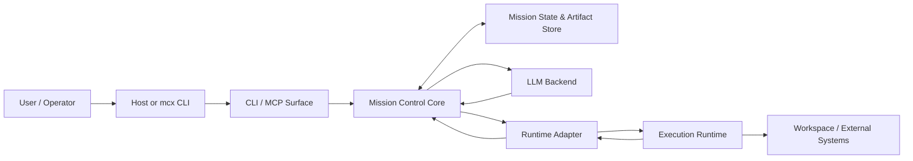
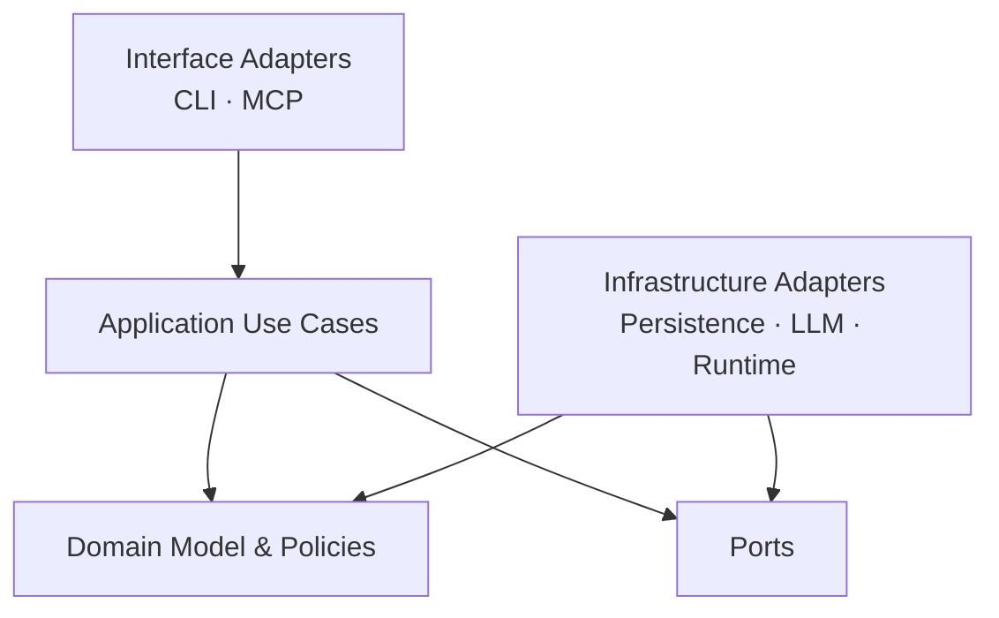
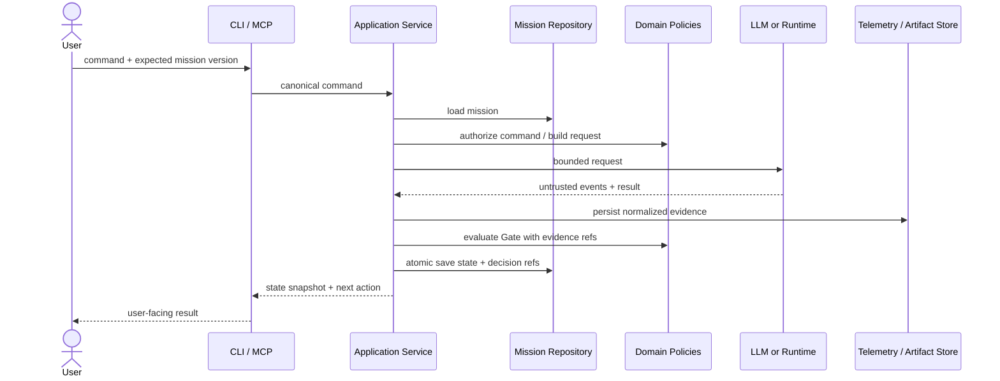

# Mission Control Architecture

> **Mission Control은 미션 상태와 진행 제어를 소유하는 control plane이다.**<br>
> **Host, LLM backend, execution runtime은 교체 가능한 경계 밖의 주체다.**

| 항목 | 값 |
|---|---|
| 문서 지위 | Active Draft — v1 아키텍처 기준과 검토 중인 제안 |
| 상위 규범 | [`00_MISSION_CONTROL.md`](./00_MISSION_CONTROL.md) |
| 인접 문서 | [`02_MISSION_LIFECYCLE.md`](./02_MISSION_LIFECYCLE.md), [`03_RUNTIME.md`](./03_RUNTIME.md), [`04_MCP.md`](./04_MCP.md) |
| 구현 언어 | Python |
| 적용 범위 | Mission Control v1 |
| 최종 갱신일 | 2026-08-07 |

이 문서는 Mission Control의 논리적 구성 요소, 책임 경계, 의존 방향, 신뢰
경계와 실패 격리 원칙을 정의한다. 클래스와 저장 기술을 미리 고정하는 문서가
아니다. 구현은 이 문서의 책임 분리와 불변식을 지켜야 하지만, 아래에서 명시적으로
`PROPOSED` 또는 `TBD`로 표시한 세부사항은 조사와 ADR을 거쳐 바뀔 수 있다.

---

## 1. 결정 상태 표기

이 문서는 다음 표기를 사용한다.

| 표기 | 의미 |
|---|---|
| **NORMATIVE** | Constitution에서 상속했거나 이 문서가 v1 기준으로 명시한 필수 경계 |
| **PROPOSED** | 구현을 시작하기 위한 권장안이며 검증 또는 ADR 전에는 확정하지 않은 설계 |
| **TBD** | 추가 조사나 사용자 결정이 필요한 항목 |
| **EXAMPLE** | 계약을 설명하기 위한 예시이며 이름이나 schema를 고정하지 않음 |

`PROPOSED` 구현이 현실과 맞지 않으면 조용히 다른 구조를 넣지 않는다. 제안의
의도, 대안, 영향 범위를 기록하고 이 문서 또는 ADR을 먼저 갱신한다.

---

## 2. 범위와 비범위

### 2.1 이 문서가 정하는 것 — NORMATIVE

- Core가 소유하는 상태와 외부 주체가 소유하는 상태의 경계
- Domain, application orchestration, port, adapter 사이의 의존 방향
- Host, LLM backend, execution runtime의 서로 다른 역할
- Gate decision, mission state, Telemetry가 만나는 일관성 경계
- Runtime 출력과 외부 입력을 불신하는 기본 보안 모델
- Core 규칙을 외부 서비스 없이 테스트할 수 있어야 한다는 조건

### 2.2 이 문서가 정하지 않는 것 — TBD 또는 후속 문서 책임

- Runtime protocol의 정확한 Python method와 이벤트 schema
- Codex/OpenCode 호출 명령, 인증, 세션 처리 방식
- MCP tool 이름, transport, host별 UX
- SQLite, 파일, event store 중 어떤 persistence 기술을 채택할지
- Python 버전, 패키지 관리자, 구체 라이브러리
- retry 횟수, timeout, 비용 한도의 수치
- Telemetry 보존 기간과 대용량 artifact 저장 방식

Runtime 세부 계약은 [`03_RUNTIME.md`](./03_RUNTIME.md), MCP surface는
[`04_MCP.md`](./04_MCP.md), 상태 전이는
[`02_MISSION_LIFECYCLE.md`](./02_MISSION_LIFECYCLE.md)가 소유한다.

---

## 3. System Context

Mission Control은 모델이나 host 안에 포함된 prompt 묶음이 아니다. 사용자와 여러
surface로부터 명령을 받아 durable mission state에 적용하고, 필요한 작업만 외부
실행 주체에 제한적으로 위임하는 독립 control plane이다.



화살표는 호출 또는 데이터 흐름을 나타내며 신뢰를 뜻하지 않는다. LLM backend와
execution runtime이 반환한 모든 결과는 검증되지 않은 입력으로 Core에 들어온다.

### 3.1 시스템 경계 안 — NORMATIVE

Mission Control 시스템 경계 안에는 다음 책임이 있다.

- canonical mission state와 revision 관리
- Stage entry/exit 계약과 허용 전이 검증
- Gate policy와 `CLEAR`/`HOLD` 기록
- dispatch 범위와 capability envelope 구성
- Runtime/LLM 결과의 정규화, domain evidence 연결, provenance 보존
- retry, Recover와 같은 control decision
- CLI와 MCP가 공유하는 application use case

operator pause/resume overlay는 **PROPOSED**이며 현재 v1의 필수 Core 책임이 아니다.
도입 여부와 상태 의미가 Lifecycle에서 확정되기 전에는 application contract나 저장
event의 필수 항목으로 가정하지 않는다.

### 3.2 시스템 경계 밖 — NORMATIVE

다음은 Mission Control이 소유하지 않는다.

- 사용자의 목표, 제품 판단, 권한 승인
- host 대화 세션의 메모리와 UI 상태
- 모델의 내부 추론과 vendor 세션 구현
- execution runtime의 내부 agent loop
- 대상 저장소와 외부 서비스의 비즈니스 상태
- shell, Git, 배포 플랫폼 자체의 동작

Mission Control은 경계 밖 상태를 관찰하고 명령할 수 있지만 그 상태를 자신의
canonical mission state로 착각해서는 안 된다.

---

## 4. Control-plane Mental Model

Mission Control을 이해할 때 **control plane**, **execution plane**, **evidence
plane**을 구분한다.

| Plane | 책임 | 대표 데이터 | 금지되는 결합 |
|---|---|---|---|
| Control plane | 현재 Stage, 정책, 전이, dispatch, Gate 결정 | Mission, Blueprint revision, GateDecision, RecoveryDirective | vendor CLI 출력으로 Stage를 직접 변경 |
| Execution plane | 제한된 작업을 실제로 수행 | Runtime request, tool call, file/process result | 자신이 수행한 작업을 `CLEAR` 처리 |
| Evidence plane | 수행·관찰 결과를 보존하고 Gate와 연결 | Telemetry, 검사 결과, artifact reference | 자연어 요약만으로 원본 증거 대체 |

이 구분은 물리적 프로세스 세 개를 반드시 만들라는 뜻이 아니다. v1에서는 한
Python 프로세스 안에 구현할 수 있다. 중요한 것은 책임과 데이터 흐름이 섞이지
않는 것이다.

### 4.1 명령과 사실의 분리 — NORMATIVE

Control plane은 “무엇을 하라”는 bounded command를 만든다. Execution plane은
“무엇이 일어났다”는 result를 반환한다. Evidence plane은 그 result의 provenance와
검증 결과를 보존한다. 다음 형태의 역방향 제어는 허용하지 않는다.

```text
Runtime text: "all done"
    └─X→ current_stage = COMPLETE
```

허용되는 흐름은 다음과 같다.

```text
Runtime result
  → canonical Runtime event
  → application maps durable domain evidence
  → Gate policy evaluates Stage contract
  → durable GateDecision
  → durable state transition
```

### 4.2 한 개의 canonical state owner — NORMATIVE

CLI, MCP host, Runtime Adapter가 각각 별도의 현재 Stage를 유지해서는 안 된다.
surface의 캐시나 host 세션에 표시된 값은 언제나 파생 상태다. 충돌 시 durable
mission state가 기준이며, stale command는 현재 revision과 대조해 거부하거나
명시적으로 재평가해야 한다.

---

## 5. 네 가지 외부 경계

특히 혼동하기 쉬운 네 대상을 별도 개념으로 유지한다.

| 대상 | 소유하는 것 | 지속성 기대 | 신뢰 수준 | Mission Control과의 계약 |
|---|---|---|---|---|
| **Host** | 사용자 상호작용, 대화/UI context, 호출 연결 | 세션에 따라 사라질 수 있음 | 인증과 입력 모두 검증 필요 | application command/query만 호출 |
| **Mission State** | Stage, revision, attempt, Gate, evidence reference | 세션보다 오래 지속되어야 함 | Core만 규칙에 따라 변경 | repository/transaction 경계로 접근 |
| **LLM Backend** | 질문·초안·분류·평가 후보 생성 | 호출 단위가 기본; vendor session은 비정규 | 출력은 untrusted proposal | 구조화된 request/result, 도구 권한 없음이 기본 |
| **Execution Runtime** | 파일 변경, 명령 실행, bounded agent work | 작업/세션에 따라 다름 | 출력과 부작용 모두 검증 필요 | capability가 제한된 dispatch와 Telemetry 반환 |

### 5.1 Host는 workflow engine이 아니다 — NORMATIVE

Host는 `brief를 진행하라`, `현재 상태를 보여 달라`, `승인을 기록하라` 같은
application command를 전달한다. host prompt나 MCP tool handler 안에 Stage 전이
규칙을 복제하지 않는다. 연결이 끊긴 뒤 재접속한 host는 저장소에서 상태를 다시
읽어야 한다.

### 5.2 Mission State는 대화 transcript가 아니다 — NORMATIVE

Transcript는 artifact 또는 출처가 될 수 있지만 canonical state를 대신하지 못한다.
질문, 답변, 가정, 승인, Blueprint revision, attempt와 Gate decision은 의미가
구조화되어야 한다. Transcript가 없더라도 현재 Stage와 진행을 막는 조건을 설명할
수 있어야 한다.

### 5.3 LLM Backend와 Execution Runtime은 다르다 — NORMATIVE

LLM backend는 질문 생성이나 의미 평가처럼 텍스트/구조화 출력을 제안한다. 기본적으로
workspace 수정 권한이 없다. Execution runtime은 파일과 process에 실제 부작용을
만들 수 있다. 하나의 vendor 제품이 두 역할을 모두 제공하더라도 Core 계약과
capability policy에서는 두 호출을 구분한다.

### 5.4 Runtime session은 mission identity가 아니다 — NORMATIVE

Codex/OpenCode session ID는 adapter metadata일 뿐이다. 세션을 잃거나 runtime을
바꿔도 동일 Mission과 Blueprint revision, attempt lineage를 이어갈 수 있어야 한다.

---

## 6. 논리적 구성 요소와 책임

아래 구성 요소는 **논리적 책임 단위**다. v1에서 각각을 별도 클래스나 서비스로
만들 필요는 없다.

### 6.1 Interface Adapters

#### CLI Adapter (`mcx`) — NORMATIVE

- 사용자 입력을 application command로 변환한다.
- 상태, Gate, 필요한 다음 행동을 사용자 용어로 렌더링한다.
- 비즈니스 규칙이나 Stage 전이를 자체 판단하지 않는다.
- 비대화형 실행에서도 구조화된 실패와 exit status를 일관되게 제공해야 한다.

#### MCP Adapter — NORMATIVE

- host 호출을 동일한 application boundary로 전달한다.
- host identity와 요청 provenance를 잃지 않는다.
- MCP tool 출력만 보고 미션 완료를 선언하지 않는다.
- Flight Controller에게 Mission Control MCP를 재노출하지 않는다.

### 6.2 Application Layer

#### Mission Application Service — NORMATIVE

하나의 use case를 시작부터 저장까지 조정한다.

- command를 현재 state/version과 대조한다.
- 필요한 domain policy를 호출한다.
- port를 통해 backend 또는 runtime에 작업을 위임한다.
- Runtime Adapter가 반환한 canonical Runtime event를 domain evidence로 매핑해 Gate
  평가에 전달한다.
- repository port를 통해 state, durable evidence, GateDecision과 evidence reference를
  일관되게 저장한다.

Application Service가 Acceptance Criteria를 임의로 만들거나 domain invariant를
우회해서는 안 된다.

#### Dispatch Coordinator — NORMATIVE responsibility

- 현재 Stage와 승인된 Blueprint에서 최소 작업 범위를 도출한다.
- capability policy로 도구, 파일, 네트워크, budget을 제한한다.
- runtime request에 immutable input revision을 연결한다.
- 취소, timeout, adapter error를 공통 실패로 정규화한다.

정확한 작업 분해 알고리즘과 병렬 dispatch는 **TBD**다. v1은 순차 dispatch만으로
시작할 수 있다.

### 6.3 Domain Layer

#### Mission Aggregate — NORMATIVE

다음 불변식을 보호하는 canonical domain boundary다.

- 한 시점에 하나의 current Stage
- 승인된 Blueprint revision 없는 Execute 금지
- 허용되지 않은 Stage 전이 금지
- 실행한 주체의 자기 승인 금지
- 과거 attempt와 GateDecision의 덮어쓰기 금지
- Verify Gate 이외의 `MISSION COMPLETE` 금지

`aggregate`라는 구현 패턴 자체를 강제하지는 않는다. 그러나 이 불변식을 여러
adapter에 분산해서는 안 된다.

#### Stage Contract / Transition Policy — NORMATIVE

Stage별 entry input, required output, exit condition과 허용 전이를 평가한다. 정확한
상태와 표는 [`02_MISSION_LIFECYCLE.md`](./02_MISSION_LIFECYCLE.md)가 소유한다.

#### Gate Policy — NORMATIVE

- 현재 Stage의 필수 evidence와 승인 조건을 평가한다.
- `CLEAR` 또는 `HOLD`와 이유, evidence reference를 만든다.
- LLM 평가를 하나의 evidence로 사용할 수 있지만 최종 권한을 넘기지 않는다.
- policy/schema version을 decision에 연결한다.

#### Capability Policy — NORMATIVE

Stage와 dispatch 역할에 따라 실제 허용 capability를 계산한다. prompt만으로 제한하지
않고 가능한 runtime enforcement로 변환한다. 지원되지 않는 enforcement는 명시적인
risk 또는 `HOLD`로 노출한다.

#### Recovery Policy — NORMATIVE responsibility

실패를 분류하고 보완 주체, 허용 범위, destination Stage, attempt budget을 결정한다.
정책 기반 routing은 [`02_MISSION_LIFECYCLE.md`](./02_MISSION_LIFECYCLE.md)에 정의한다.

### 6.4 Ports

Core가 필요로 하는 외부 기능은 port로 표현한다. 아래 이름은 **PROPOSED**이며
의미적 경계만 NORMATIVE다.

| Port 후보 | Core가 요구하는 의미 | Adapter 예시 |
|---|---|---|
| `MissionRepository` | version을 대조한 mission load/save | file, SQLite |
| `ArtifactStore` | immutable revision과 blob reference 저장 | filesystem, object store |
| `TelemetrySink` | application이 만든 domain evidence의 durable 기록 | file, database |
| `LLMBackend` | bounded generation/evaluation request | local/remote model adapter |
| `ExecutionRuntime` | capability-limited dispatch와 event/result | Codex, OpenCode |
| `Clock` | 결정적 timestamp 제공 | system/fake clock |
| `IdGenerator` | mission/attempt/evidence 식별자 | UUID/deterministic fake |

repository, artifact, telemetry를 하나의 저장 adapter로 구현할 수 있다. 논리적
계약을 합친 물리 구현이 그 책임까지 혼합하는 것은 아니다.

### 6.5 Infrastructure Adapters

- persistence adapter는 application/repository port를 통해 받은 state와 domain evidence를
  durable하게 기록하고 Core의 version/immutability 조건을 보장한다.
- LLM adapter는 provider 형식을 공통 result로 정규화한다.
- Runtime Adapter는 provider transport secret을 제거한 vendor event를 canonical Runtime
  event로 정규화하며 domain evidence나 정책을 결정하지 않는다.
- process/filesystem adapter는 경로, timeout, exit signal을 명시적으로 보고한다.

Runtime Adapter는 `MissionRepository`, `ArtifactStore`, `TelemetrySink`를 직접 호출하지
않는다. application이 canonical Runtime event를 domain evidence로 매핑하고 repository
port를 통해 durable state/evidence 저장을 조정한다.

Adapter가 지원하지 않는 capability를 성공한 것처럼 꾸며서는 안 된다.

---

## 7. 의존 방향

### 7.1 기본 규칙 — NORMATIVE

소스 코드 의존은 바깥에서 안쪽으로 향한다.



- Domain은 CLI, MCP, Codex, OpenCode, SQL, filesystem을 import하지 않는다.
- Application은 구체 adapter 대신 port에 의존한다.
- Interface adapter는 application use case를 호출하고 domain 상태를 직접 수정하지
  않는다.
- Infrastructure adapter는 domain/application이 정의한 계약을 구현한다.
- vendor event type은 adapter 경계를 넘어 canonical state에 저장하지 않는다.

### 7.2 허용되는 데이터 의존 — NORMATIVE

외부 식별자, 원본 payload, vendor metadata는 provenance를 위해 artifact 또는
Telemetry에 저장할 수 있다. 그러나 Gate와 transition policy가 vendor 필드에 직접
의존하면 안 된다. 먼저 canonical result로 정규화해야 한다.

### 7.3 순환 오케스트레이션 금지 — NORMATIVE

```text
Mission Control → Runtime → Flight Controller → Mission Control MCP
```

위 호출 고리는 금지한다. Flight Controller에 제공하는 도구 집합에서 Mission
Control control surface를 제거해야 한다. 외부 host가 새 command를 보내는 것은
사용자/host boundary의 별도 요청이며 runtime 내부 재귀가 아니다.

---

## 8. 핵심 Control/Data Flow

### 8.1 공통 command 처리 — PROPOSED v1 sequence



외부 호출이 필요 없는 command는 External 단계를 생략한다. 정확한 transaction
구현은 persistence 선택에 따라 달라진다.

### 8.2 Brief 흐름 — NORMATIVE shape

1. 저장된 Brief state와 unresolved decisions를 읽는다.
2. LLM backend에 필요한 context만 전달해 질문 후보 또는 clarity 평가를 받는다.
3. 출력의 schema, provenance와 scope를 검증한다.
4. 사용자 답변과 출처를 새 revision/event로 저장한다.
5. 명시적 사용자 승인과 Stage contract를 Gate가 평가한다.
6. `CLEAR`일 때만 Blueprint로 전이한다.

Brief용 backend는 workspace write나 shell capability를 받지 않는다.

### 8.3 Execute 흐름 — NORMATIVE shape

1. 승인된 Blueprint revision을 고정한다.
2. Acceptance Criterion에 추적되는 bounded dispatch를 만든다.
3. Capability Policy가 실제 runtime 제약으로 변환 가능한지 확인한다.
4. Runtime Adapter를 통해 Flight Controller를 실행한다.
5. adapter의 canonical Runtime event를 application이 attempt/AC domain evidence로
   매핑하고 repository를 통해 보존한다.
6. Execute Gate는 **검증 가능한 결과가 준비되었는지**만 판단한다.
7. `CLEAR`는 Verify 진입을 허용할 뿐 완료를 뜻하지 않는다.

### 8.4 Verify와 Recover 흐름 — NORMATIVE shape

Verify는 결정적 검사를 먼저 수행하고 각 Acceptance Criterion을 evidence와 연결한다.
`HOLD`인 경우 Recovery Policy가 실패 분류와 bounded corrective path를 만든다.
Recover dispatch는 실패와 무관한 범위로 확장할 수 없고, 결과는 반드시 다시
Verify를 통과해야 한다.

---

## 9. Persistence와 일관성 경계

### 9.1 반드시 보존할 의미 — NORMATIVE

- mission identity, current Stage와 state version
- Brief 질문·답변·가정·출처
- Blueprint revision, 승인 주체·시각·대상 revision
- 각 Stage/Recover attempt와 parent/trigger 관계
- dispatch 당시의 scope와 capability envelope
- raw Runtime observation, canonical Runtime event와 domain evidence의 lineage/reference
- 모든 GateDecision과 사용한 policy/schema version
- cancellation과 operator intervention 같은 확정된 control event
- 최종 verification report

pause/resume event는 Lifecycle의 제안이 채택될 때만 이 목록에 추가한다. 현재 v1
persistence contract는 pause/resume event를 필수로 요구하지 않는다.

### 9.2 불변 artifact와 가변 projection — NORMATIVE

과거 Blueprint revision, 닫힌 attempt, Telemetry와 GateDecision은 수정해서 최신값으로
만들지 않는다. 정정이 필요하면 새 revision 또는 superseding record를 만든다.
반면 `current_stage`, `latest_gate`, `active_attempt` 같은 조회용 projection은 갱신될
수 있다. projection을 잃어도 불변 기록에서 현재 상태를 설명할 수 있어야 한다는
수준까지 요구할지는 저장 방식 결정 시 확정한다.

### 9.3 전이의 원자성 — NORMATIVE semantic contract

Stage 전이는 최소한 다음 항목이 함께 durable해졌을 때만 성공으로 응답한다.

```text
previous mission version
GateDecision
evidence references used by the decision
new current Stage / mission status
new mission version
```

저장 실패 또는 version conflict가 발생하면 외부 호출이 성공했더라도 전이를 성공
처리하지 않는다. 이미 발생한 외부 부작용은 orphaned attempt/evidence로 보존하고
재조정 대상으로 표시해야 한다.

### 9.4 저장 기술 — TBD

초기 후보는 다음과 같다.

| 후보 | 장점 | 검증할 위험 |
|---|---|---|
| File-based records | 투명하고 학습하기 쉬움, Git diff 가능 | locking, atomic update, query 비용 |
| SQLite | transaction과 단일 파일 배포 | artifact 크기, migration, 동시 access |
| Event store | provenance와 재구성에 자연스러움 | v1 복잡도와 projection 유지비 |

선택 전 최소 실험은 crash 중 전이, 중복 command, stale writer, 대용량 runtime output을
검증해야 한다. 완전한 event sourcing은 v1 필수 조건이 아니다.

### 9.5 동시성과 Idempotency — NORMATIVE boundary / mechanism TBD

v1은 mission 단위 optimistic version check를 사용하고, 한 mission에 한 개의
mutating command만 commit하도록 시작하는 안을 권장한다. 서로 다른 mission의
병렬성은 허용할 수 있다. 구체 lock/transaction 방식은 persistence ADR에서 정한다.

외부 side effect 또는 durable mutation을 일으킬 수 있는 application command는
application-command boundary에서 idempotency를 **반드시** 검증한다. CLI/MCP 같은
inbound adapter는 key를 전달하고 Runtime Adapter도 application이 제공한 key/token을
전달할 수 있지만, key의 동등성, payload conflict, 기존 결과 재사용과 새 attempt 생성
여부는 application/Core가 소유한다. adapter가 독자적인 중복 처리 의미를 만들거나
자기 저장소를 canonical idempotency store로 사용해서는 안 된다.

정확한 key 형식, namespace, schema, 보존 기간과 저장 기술은 **TBD**다. exact-once를
주장하지 않으며 stale state와 응답 유실이 동일 Stage 전이 또는 외부 invocation을
중복 생성하지 않게 해야 한다.

---

## 10. Telemetry Boundary

### 10.1 Telemetry의 위치 — NORMATIVE

Telemetry는 logging subsystem의 부산물이 아니라 Gate 입력이다. 다음 세 층은
**Accepted conceptual baseline**이며 exact event/envelope/evidence schema는 **TBD**다.

| 층 | 내용 | 책임과 사용 방식 |
|---|---|---|
| Raw Runtime observation | stdout/stderr, vendor event, diff, test report 원문 | Runtime Adapter가 수집하고 provider transport secret을 제거한 뒤 canonicalization 입력 또는 redacted artifact로 반환 |
| Canonical Runtime event | command, outcome, duration, changed scope, invocation lifecycle | Runtime Adapter가 vendor 차이를 정규화해 application에 반환하며 직접 저장하지 않음 |
| Domain evidence / evaluation | attempt·AC mapping, 판정, 위험, missing evidence | application이 canonical event에서 만들고 repository가 durable하게 저장하며 GateDecision이 참조 |

application은 세 층 사이의 lineage를 연결하고 persistence port를 통해 durable record를
저장한다. 물리적으로 같은 store를 사용하더라도 Runtime Adapter가 durable evidence나
Mission state를 직접 persist해서는 안 된다.

자연어 summary가 raw evidence를 대체할 수 없다. raw data를 보존할 수 없는 경우에는
그 이유, hash/locator, 수집 실패 자체를 Telemetry로 남긴다.

### 10.2 Provenance — NORMATIVE

모든 evidence는 최소한 mission, Stage, attempt, producer, runtime/backend identity,
입력 revision, 수집 시각, 원본/요약 여부에 연결되어야 한다. GateDecision은 사용한
evidence reference를 열거해야 한다.

### 10.3 Telemetry와 일반 로그의 차이

- 운영 로그는 진단과 관찰을 돕지만 보존이 보장되지 않을 수 있다.
- Telemetry는 미션 판단을 재현하거나 설명하기 위한 durable evidence다.
- 같은 이벤트가 둘 다에 기록될 수 있지만 Gate는 ephemeral log locator에만
  의존해서는 안 된다.

### 10.4 비밀값과 크기 제한 — NORMATIVE/TBD

자격 증명과 불필요한 개인정보를 Telemetry에 저장하지 않는 것은 NORMATIVE다.
Runtime Adapter는 provider token, authorization header, transport credential처럼 provider
transport에 속한 secret을 canonicalization 전에 제거한다. 그 다음 application과
persistence boundary는 mission content, path, 사용자 데이터처럼 domain-sensitive한
필드를 durable storage 전에 다시 redaction한다. 어느 계층도 이전 계층의 정제를
신뢰해 검사를 생략하지 않는다.

정확한 field policy, 원문 암호화, 최대 artifact 크기와 보존 기간은 **TBD**다.
redaction으로 검증 근거가 손상되면 그 제약을 명시하고 안전한 별도 artifact 전략을
결정해야 한다.

---

## 11. Security와 Trust Model

### 11.1 신뢰 가정 — NORMATIVE

- 사용자도 실수할 수 있지만 Goal, 제품 결정, 권한의 최종 authority다.
- host 입력은 인증 여부와 무관하게 schema, mission identity, revision을 검증한다.
- 저장소에서 읽은 state도 schema/version 검증 없이 사용하지 않는다.
- LLM과 Runtime 출력은 prompt injection, 조작된 성공 보고, 잘못된 path를 포함할 수
  있는 untrusted data다.
- 대상 repository의 파일 내용도 instruction으로 자동 승격하지 않는다.

### 11.2 Capability enforcement — NORMATIVE

각 dispatch는 다음을 명시하고 가능한 실제 수단으로 강제한다.

- 허용된 read/write path와 명시적 비범위
- 사용할 수 있는 tool/process 목록
- network, external message, deploy 권한
- 시간, 비용, 시도 budget
- secret 접근 여부
- 허용된 Mission Control surface 부재

Runtime이 필요한 제한을 강제할 수 없으면 adapter가 capability를 `unsupported`로
보고한다. Core는 위험에 따라 dispatch를 `HOLD`하거나 추가 승인을 요구해야 하며,
prompt상의 금지 문구만으로 강제된 것처럼 표시해서는 안 된다.

### 11.3 권한 상승과 파괴적 행동 — NORMATIVE

- Blueprint의 일반 구현 승인은 배포, 데이터 삭제, 외부 메시지 전송을 암묵적으로
  승인하지 않는다.
- 추가 권한은 목적, 대상, 지속 시간을 제한해 사용자에게 받아야 한다.
- Runtime이 권한 부족으로 실패하면 자동으로 더 강한 권한으로 재시도하지 않는다.
- scope 밖 path 접근, secret 노출, recursive MCP 호출 시도는 security Telemetry로
  남기고 정책에 따라 즉시 중단한다.

### 11.4 Prompt injection 경계 — NORMATIVE

repository 문서, issue text, command output, model response는 모두 mission input의
한 종류일 뿐 상위 지침이 아니다. Core가 구성한 role, scope, capability 정책을
외부 content가 바꿀 수 없어야 한다. adapter는 content와 control metadata를 서로
다른 필드로 전달해야 한다.

### 11.5 Auditability — NORMATIVE

누가 어떤 revision을 승인했고 어떤 capability로 무엇을 실행했는지 사후 설명할 수
있어야 한다. 감사 가능성은 모든 prompt/사고 과정을 저장한다는 뜻이 아니라,
control decision과 관찰 가능한 evidence의 lineage를 보존한다는 뜻이다.

---

## 12. Failure Boundaries와 격리

외부 실패를 하나의 `Exception`이나 `agent failed`로 뭉개면 Recovery Policy가 올바른
행동을 선택할 수 없다.

| 실패 경계 | 예시 | Core의 최소 반응 | 금지되는 반응 |
|---|---|---|---|
| Interface | 잘못된 command, stale version, 인증 부재 | 요청 거부, state 불변 | 임의 보정 후 실행 |
| Application | orchestration bug, partial result | 실패 기록, commit 중단 | 성공 응답 |
| Persistence | disk full, conflict, corruption | fail closed, 전이 금지 | 메모리 상태만 진행 |
| LLM backend | timeout, malformed schema, refusal | 분류된 failure Telemetry | 빈 결과를 승인으로 해석 |
| Runtime adapter | protocol mismatch, unsupported capability | adapter failure로 격리 | criterion failure로 위장 |
| Execution runtime | command failure, sandbox denial, crash | attempt를 닫고 실제 결과 보존 | 전체 미션 상태 손상 |
| Verification | test failure, evidence missing, scope drift | `HOLD`와 criterion mapping | 자연어 확신으로 우회 |
| Security | secret leak, out-of-scope mutation | 즉시 중단/격리, operator action | 자동 권한 상승 |

### 12.1 외부 부작용과 commit 실패 — PROPOSED reconciliation

Runtime이 파일을 바꾼 뒤 Mission State 저장이 실패할 수 있다. 분산 transaction을
가정하지 않는다. 대신 다음 reconciliation 정보를 보존하는 전략을 검토한다.

- dispatch/attempt ID를 runtime 시작 전에 durable하게 예약
- workspace locator와 시작 revision/snapshot
- runtime result의 idempotent ingest
- state commit에 연결되지 않은 orphan result 표시
- operator 또는 recovery process가 재수집할 수 있는 절차

정확한 protocol은 Runtime/Persistence ADR에서 확정한다.

### 12.2 실패의 전파 범위 — NORMATIVE

한 mission의 실패가 다른 mission state를 손상해서는 안 된다. 한 adapter의
불가용성이 Domain rule을 바꾸어서는 안 된다. 일부 Telemetry 저장 실패가 발생하면
evidence가 필요한 `CLEAR`는 허용하지 않는다.

---

## 13. Testability Architecture

### 13.1 Core determinism — NORMATIVE

Domain과 Gate policy는 network, 실제 clock, 실제 filesystem, vendor runtime 없이
테스트할 수 있어야 한다. 동일 state, policy version, evidence를 주면 설명 가능한
동일 결정을 만들어야 한다.

### 13.2 Test doubles — PROPOSED

초기 vertical slice에는 다음 결정적 test double을 둔다.

- scripted `LLMBackend`: 질문/구조화 결과/오류를 순서대로 반환
- scripted `ExecutionRuntime`: event와 result, timeout, crash를 재현
- in-memory `MissionRepository`: version conflict와 저장 실패 주입
- in-memory `ArtifactStore`/`TelemetrySink`: 누락·중복 evidence 재현
- fake clock과 deterministic ID generator

이 이름과 분리는 제안이며 실제 port 설계와 함께 조정한다.

### 13.3 필수 테스트 층 — NORMATIVE

1. **Domain invariant tests**: 승인 없는 Execute, 불법 전이, 자기 승인 거부
2. **State transition tests**: 모든 `CLEAR`, `HOLD`, Recover routing
3. **Gate policy tests**: missing/malformed/stale evidence와 policy version
4. **Port contract tests**: 모든 persistence/runtime adapter가 동일 의미 보장
5. **Interface integration tests**: CLI와 MCP가 동일 use case 결과를 관찰
6. **End-to-end scenarios**: Brief부터 `MISSION COMPLETE`, 실패 후 Recover

### 13.4 Failure injection — NORMATIVE

happy path만으로 아키텍처 경계를 검증할 수 없다. 최소한 다음을 주입한다.

- 외부 호출 성공 후 state 저장 실패
- 중복 command와 stale mission version
- malformed LLM/Runtime output
- timeout/cancel 중 partial Telemetry
- Runtime의 out-of-scope change 보고
- 증거 누락 상태의 `CLEAR` 시도
- Recover 반복과 budget 소진
- host 연결 종료 후 새 host에서 resume

### 13.5 Adapter contract — NORMATIVE

Codex와 OpenCode adapter는 같은 canonical outcome 의미를 만족해야 한다. vendor별
통합 테스트 외에 공통 contract suite를 재사용한다. Runtime 없는 Core 테스트가
실패하면 vendor end-to-end 성공으로 이를 상쇄할 수 없다.

---

## 14. Provisional Package Layout — PROPOSED, NOT COMMITTED

다음 구조는 의존 방향과 책임 분리를 검토하기 위한 제안이다. 실제 폴더를 생성하거나
공개 API로 확정한 것이 아니다.

```text
src/
└─ mission_control/
   ├─ domain/
   │  ├─ mission.py           # Mission invariants and value objects
   │  ├─ lifecycle.py         # Stage and transition rules
   │  ├─ gates.py             # Gate decisions and policies
   │  ├─ capabilities.py      # Capability policy concepts
   │  └─ recovery.py          # Failure classification and routing
   ├─ application/
   │  ├─ commands.py          # Mutating use-case input types
   │  ├─ queries.py           # Read-only use cases
   │  ├─ services.py          # Orchestration
   │  └─ ports.py             # Required external contracts
   ├─ adapters/
   │  ├─ persistence/
   │  ├─ llm/
   │  ├─ runtime/
   │  │  ├─ codex.py
   │  │  └─ opencode.py
   │  ├─ cli/
   │  └─ mcp/
   └─ bootstrap.py            # Composition root only
tests/
├─ unit/
├─ contracts/
├─ integration/
└─ scenarios/
```

### 14.1 이 제안의 의도

- Domain이 adapter import를 하지 않도록 물리적 힌트를 제공한다.
- CLI/MCP가 같은 application use case를 사용하게 한다.
- Runtime adapter를 vendor별로 격리한다.
- composition root에서만 구체 구현을 조립한다.

### 14.2 확정 전에 검증할 질문

- `ports.py` 하나가 커지는지, inbound/outbound port를 분리할지
- canonical Runtime event port와 domain evidence persistence port를 실제 package에서
  어떻게 분리할지
- Stage별 module이 lifecycle 중심 module보다 이해하기 쉬운지
- package명이 PyPI/CLI 배포와 충돌하지 않는지
- 하나의 process로 충분한지, MCP server lifecycle을 어떻게 조립할지

구조가 확정되기 전 문서와 코드에서 위 경로를 이미 존재하는 API처럼 참조하지
않는다.

---

## 15. Deployment와 Process Topology — PROPOSED

v1의 가장 작은 구성은 하나의 local Python application과 durable local store다.
`mcx`와 MCP server가 동일 Core package를 사용하되 별도 process로 실행될 수 있다.
별도 서비스, message broker, distributed worker는 핵심 Workflow를 검증하는 데 필요할
때만 도입한다.

```text
Local user workspace
├─ mcx process ─┐
├─ MCP process ─┼─ shared application/core package
└─ state store ─┘
        │
        ├─ LLM backend calls
        └─ Codex/OpenCode runtime processes
```

공유 store를 둘 이상의 process가 쓸 수 있으므로 atomic write/version check가
필요하다. MCP와 CLI를 동시에 지원한다는 이유만으로 네트워크 daemon을 필수화하지
않는다.

---

## 16. Architecture Invariants

다음은 구현 구조와 무관하게 지켜야 한다.

1. canonical mission state의 writer는 Mission Control Core 경계 하나다.
2. CLI와 MCP는 workflow 규칙을 복제하지 않는다.
3. Domain은 vendor Runtime, host, persistence 기술을 모른다.
4. LLM output과 Runtime output은 검증되지 않은 proposal/evidence input이다.
5. LLM backend 호출과 부작용 가능한 execution runtime 호출을 구분한다.
6. Stage 전이는 durable GateDecision과 evidence reference 없이 성공하지 않는다.
7. 저장 실패는 메모리상의 성공 전이로 대체하지 않는다.
8. 승인된 Blueprint revision과 모든 downstream attempt를 연결한다.
9. 닫힌 attempt, GateDecision, 실패 Telemetry를 덮어쓰지 않는다.
10. Runtime Adapter는 Stage, semantic retry/Recover, 완료를 결정하지 않는다. side
    effect 전에 실패했고 재전송 안전성이 입증된 transport failure만 같은 attempt에서
    제한적으로 retry할 수 있다.
11. Flight Controller에 Mission Control을 재귀 호출할 capability를 주지 않는다.
12. capability 제한은 가능한 실제 enforcement로 구현한다.
13. Core는 deterministic test double로 외부 서비스 없이 검증 가능해야 한다.
14. 특정 vendor의 성공 경로가 공통 계약 실패를 정당화하지 않는다.

---

## 17. Decision Ledger

### 17.1 확정 또는 규범적 기준

| 결정 | 상태 | 근거 |
|---|---|---|
| Mission Control은 control plane이며 코드 작성자/리뷰어가 아니다. | NORMATIVE | Constitution |
| Mission state와 Stage 전이는 Core가 단독 소유한다. | NORMATIVE | Constitution |
| CLI와 MCP는 동일 application boundary를 사용한다. | NORMATIVE | Constitution + 이 문서 |
| Core는 Runtime-neutral이며 adapter가 vendor 차이를 격리한다. | NORMATIVE | Constitution |
| LLM backend와 execution runtime을 별도 책임으로 모델링한다. | NORMATIVE | Constitution + 이 문서 |
| GateDecision과 관련 evidence 없이 전이를 commit하지 않는다. | NORMATIVE | Evidence over reasoning |
| 외부 출력과 repository content는 untrusted input이다. | NORMATIVE | Least capability / trust boundary |
| persistence와 Runtime adapter는 재사용 가능한 contract test 대상이다. | NORMATIVE | Project verification policy |
| side-effecting application command는 application boundary에서 idempotency를 검증한다. | NORMATIVE | 동시성·중복 요청 안전성 |
| Raw Runtime observation → canonical Runtime event → domain evidence/evaluation의 세 층을 구분한다. | NORMATIVE conceptual baseline | Evidence boundary |

### 17.2 권장하지만 아직 확정하지 않은 설계

| 제안 | 상태 | 확정 위치 또는 검증 |
|---|---|---|
| mission-level optimistic version check | PROPOSED | Persistence ADR |
| 단일 local process 중심의 v1 topology | PROPOSED | 첫 vertical slice |
| dispatch ID를 외부 호출 전에 durable 예약 | PROPOSED | Runtime/Persistence ADR |
| logical ports와 provisional package layout | PROPOSED | Python skeleton review |
| deterministic fake clock/ID/runtime/backend | PROPOSED | Test architecture |

---

## 18. Open Decisions

구현 편의로 아래 결정을 암묵적으로 고정하지 않는다.

### 18.1 Persistence

- 파일, SQLite, 다른 store 중 v1에 가장 작은 올바른 선택은 무엇인가?
- state, metadata, 대용량 artifact를 같은 store에 둘 것인가?
- crash 후 partial attempt를 어떻게 발견하고 reconcile할 것인가?
- migration과 schema version을 언제 도입할 것인가?
- immutable record와 projection의 관계를 어느 수준까지 보장할 것인가?

### 18.2 Telemetry

- canonical event/envelope schema와 evidence content type은 무엇인가?
- provider transport secret과 domain-sensitive field의 exact redaction rule은 무엇인가?
- hash, locator, inline payload의 선택 기준은 무엇인가?
- 보존 기간, 크기 제한, 삭제 정책을 누가 승인하는가?

### 18.3 Runtime와 LLM

- LLM backend를 Runtime protocol의 하위 capability로 둘지 별도 port로 둘지?
- streaming event, cancellation, timeout의 공통 의미는 무엇인가?
- Runtime이 filesystem scope를 강제하지 못할 때 v1은 실행을 막을 것인가?
- Codex/OpenCode session resume를 최적화로 볼지 의미적 계약으로 볼지?

### 18.4 Application/API

- application command idempotency key의 exact schema, namespace, 보존 기간과 store는 무엇인가?
- 긴 실행을 synchronous command로 둘지 job/poll 모델로 둘지?
- MCP process와 CLI process가 같은 mission을 동시에 수정할 때 UX는 무엇인가?
- operator pause/cancel의 terminal 의미는 무엇인가?

### 18.5 Security

- workspace trust root와 허용 path를 어떻게 표현할 것인가?
- secret redaction 실패 시 evidence를 폐기, 격리, 암호화 중 어떻게 처리할 것인가?
- host identity와 Blueprint approval identity를 어떻게 증명할 것인가?
- 외부 네트워크/배포 capability 승인 기록의 수명은 얼마인가?

---

## 19. Architecture Review Checklist

새 component, adapter, 저장 방식 또는 surface를 추가할 때 다음을 확인한다.

- [ ] 이 책임은 control, execution, evidence plane 중 어디에 속하는가?
- [ ] canonical state를 우회해 쓰는 두 번째 writer가 생기지 않는가?
- [ ] Domain이 vendor나 transport 타입을 import하지 않는가?
- [ ] host/Runtime 세션을 mission identity로 사용하지 않는가?
- [ ] LLM 호출과 부작용 가능한 runtime 호출의 권한을 분리했는가?
- [ ] 실패가 분류된 Telemetry로 남고 Gate가 fail closed하는가?
- [ ] state와 evidence commit 사이의 partial failure를 설명할 수 있는가?
- [ ] Stage별 capability가 실제로 강제되는가?
- [ ] 외부 서비스 없는 deterministic test가 가능한가?
- [ ] 새 세부 결정이 `PROPOSED`/`TBD`인데 코드로 먼저 고정되지 않았는가?
- [ ] Constitution 또는 Lifecycle과 충돌한다면 먼저 문서를 변경했는가?

---

## Closing Architecture Principle

좋은 Mission Control 아키텍처는 많은 adapter를 연결한 구조가 아니다. host와
runtime이 바뀌거나 실패해도 **durable intent, bounded authority, evidence-backed
transition**을 잃지 않는 구조다.

> **Surfaces request. Runtimes act. Applications evidence. Repositories persist. Core decides.**
