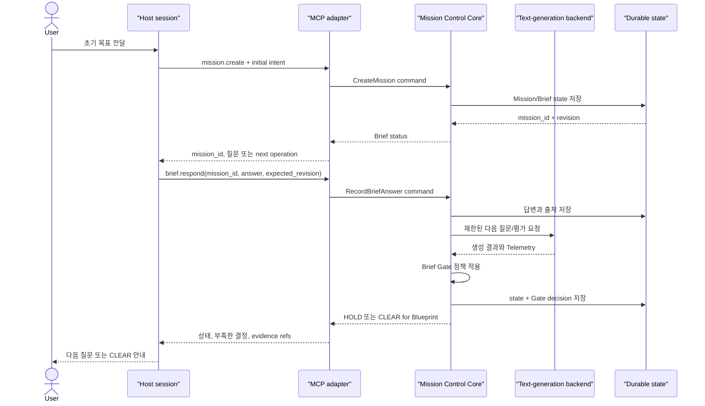
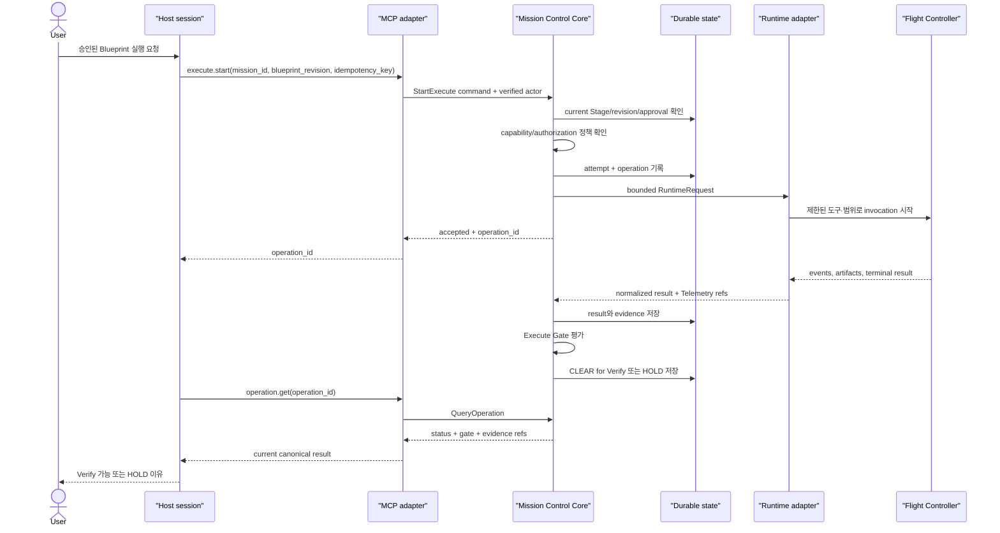

# MCP Control Surface and Host Integration

> **MCP는 Mission Control의 본체가 아니다.**<br>
> **MCP는 host가 동일한 Core application boundary를 호출하는 control surface다.**<br>
> **Host session, durable Mission, Runtime worker는 서로 다른 수명을 가진다.**

| 항목 | 값 |
|---|---|
| 문서 지위 | Active Draft — MCP 통합 설계 기준 |
| 상위 기준 | `00_MISSION_CONTROL.md` |
| 인접 문서 | [`01_ARCHITECTURE.md`](./01_ARCHITECTURE.md), [`02_MISSION_LIFECYCLE.md`](./02_MISSION_LIFECYCLE.md), [`03_RUNTIME.md`](./03_RUNTIME.md) |
| 적용 범위 | v1 MCP server surface, host identity/state 연동, CLI parity |
| 정확한 tool 이름·schema·transport | **TBD — 구현 전 ADR과 통합 테스트로 확정** |

이 문서는 Claude, Codex, OpenCode 또는 다른 MCP host가 Mission Control을 안전하게
호출하는 방법을 정의한다. MCP는 transport와 host integration을 제공할 뿐, Mission
Lifecycle이나 Gate 정책을 복제하지 않는다.

이 문서의 tool 이름과 request/response 구조는 모두 **논리적 후보**다. MCP server의
실제 schema, transport, SDK, protocol version은 현재 upstream 공식 자료를 조사하고
ADR로 확정하기 전까지 public contract가 아니다.

이 문서의 `MUST`, `MUST NOT`, `SHOULD`, `MAY`는 Constitution의 규범 언어를
따른다. 충돌 시 Constitution이 우선한다.

---

## 1. 결정 요약

1. MCP는 Core 위의 inbound adapter/control surface다.
2. MCP server는 Mission state, Stage machine, Gate policy를 별도로 구현하지 않는다.
3. CLI `mcx`와 MCP는 같은 application use case를 호출하고 같은 canonical state를
   본다.
4. host 대화 session은 durable Mission의 identity나 저장소가 아니다.
5. Runtime worker/session/thread는 host session 및 Mission과 분리해 추적한다.
6. MCP tool 호출은 Stage 전이를 명령하지 않고 application operation을 요청한다.
   전이는 Core Gate가 근거를 검증해 결정한다.
7. Blueprint 승인, 권한 확대, 파괴적 외부 행동에는 추적 가능한 actor와 명시적
   authorization이 필요하다.
8. Flight Controller에게 Mission Control MCP orchestration tool을 노출하지 않는다.
9. `HOLD`는 domain outcome이며 transport failure로 숨기지 않는다.
10. 정확한 tool schema와 설치 방식은 아직 확정하지 않는다.
11. side effect가 있는 command의 idempotency는 application-command boundary에서
    필수이며 MCP handler는 key를 전달할 뿐 의미나 저장을 소유하지 않는다.

---

## 2. 목표와 비목표

### 2.1 목표

- host가 Mission을 만들고 조회하며 현재 Stage에 맞는 작업을 요청하게 한다.
- host가 바뀌거나 대화가 종료되어도 동일 Mission을 이어가게 한다.
- MCP와 CLI 사이의 상태·권한·Gate 의미가 달라지지 않게 한다.
- tool 요청에서 actor, mission, revision, idempotency, invocation origin을 추적한다.
- 장기 실행의 progress, cancellation, final result를 안전하게 관찰하게 한다.
- host가 오래된 schema를 사용하거나 tool discovery가 불완전할 때 안전하게 실패한다.
- Flight Controller의 재귀 오케스트레이션과 권한 세탁을 차단한다.
- transport, application, domain, Runtime failure를 구분한다.

### 2.2 비목표

- MCP 요청 자체를 durable Mission으로 간주하지 않는다.
- host 대화 기록을 Mission database로 사용하지 않는다.
- MCP server 내부에 두 번째 Workflow engine을 만들지 않는다.
- 모든 내부 repository 또는 admin operation을 tool로 노출하지 않는다.
- host가 Gate를 임의로 `CLEAR`하거나 `MISSION COMPLETE`로 설정하게 하지 않는다.
- MCP convenience를 위해 Blueprint 승인 규칙을 완화하지 않는다.
- Flight Controller가 MCP를 통해 하위 Mission을 자동 생성하게 하지 않는다.
- v1에서 대시보드, multi-tenant SaaS, distributed queue까지 선행 구현하지 않는다.
- upstream MCP 또는 host의 현재 구현 세부를 근거 없이 사실로 단정하지 않는다.

---

## 3. Architecture Position

```text
Host UI / Agent Session
        │
        │ MCP request
        ▼
MCP Inbound Adapter
  ├─ transport/schema validation
  ├─ host/auth context normalization
  └─ application request mapping
        │
        ▼
Mission Control Application
  ├─ authorization and revision checks
  ├─ lifecycle use cases
  ├─ Gate policy
  ├─ persistence transaction
  └─ Runtime dispatch port
        │
        ▼
Runtime Adapter → bounded Flight Controller
```

MCP layer의 의존 방향은 application 쪽을 향한다.

```text
MCP adapter -> application ports -> domain
```

다음 구조는 금지한다.

```text
domain -> MCP SDK types
MCP tool handler -> vendor Runtime directly
MCP-only mission database
CLI workflow rules != MCP workflow rules
```

### 3.1 MCP handler의 최소 책임

- transport input을 schema에 따라 검증한다.
- 인증된 host/actor context를 application identity로 정규화한다.
- logical operation과 application command/query를 매핑한다.
- application result를 안정적인 MCP response 또는 error로 변환한다.
- correlation ID와 redacted audit Telemetry를 남긴다.
- transport 연결 종료와 Mission/Runtime cancellation을 혼동하지 않는다.

### 3.2 MCP handler가 해서는 안 되는 일

- 현재 Stage에 따라 자체 분기하여 Core 규칙을 복제한다.
- 누락된 Mission state를 host 대화에서 추측한다.
- Runtime의 “done” 문자열을 `CLEAR`로 변환한다.
- approval actor가 없는 Blueprint를 승인 처리한다.
- revision conflict를 last-write-wins로 덮어쓴다.
- host 요청의 권한을 Runtime capability로 그대로 확대 전달한다.

---

## 4. 세 가지 Identity와 수명

MCP 통합에서 가장 중요한 구분은 host session, Mission, Runtime worker/thread다.

### 4.1 Host session

host가 사용자와 대화하거나 MCP server 연결을 유지하는 문맥이다.

- 연결·대화·client process 수명에 따라 종료될 수 있다.
- 같은 host session이 여러 Mission을 다룰 수 있다.
- 하나의 Mission을 여러 host session에서 이어갈 수 있다.
- host가 제공하는 session ID는 optional correlation 정보다.
- host 대화에만 있는 결정은 durable Mission 결정이 아니다.

### 4.2 Durable Mission

Brief부터 Verify의 최종 판정까지 이어지는 canonical 작업 단위다.

- Mission Control이 `mission_id`를 발급한다.
- current Stage, Blueprint revision, attempts, Gate decisions를 저장한다.
- host session과 Runtime을 교체해도 유지된다.
- 명시적 조회/선택 없이 “현재 채팅의 Mission”을 암묵 추측하지 않는 것이 기본이다.
- alias나 recent-Mission convenience를 제공하더라도 resolved `mission_id`를 응답에
  포함해야 한다.

### 4.3 Runtime worker/session/thread

bounded dispatch를 수행하는 실행 주체 또는 vendor 연속성 식별자다.

- Mission의 특정 Stage/attempt/invocation 아래에 연결된다.
- Runtime vendor namespace와 함께 저장한다.
- worker가 끝나도 Mission은 남는다.
- worker를 재개해도 권한과 Blueprint revision을 다시 검증한다.
- Runtime session을 host session과 같은 것으로 취급하지 않는다.

### 4.4 Identity chain

```text
actor_id / principal
  └─ host_connection_id? / host_session_id?
      └─ request_id
          └─ mission_id
              └─ stage + mission_revision
                  └─ attempt_id
                      └─ operation_id
                          └─ runtime_invocation_id?
                              └─ vendor_session/thread_id?
```

모든 ID를 모든 응답에 반복할 필요는 없지만, audit trail에서 요청부터 Runtime
Telemetry까지 연결할 수 있어야 한다. vendor ID는 Mission ID를 대신하지 않는다.
`operation_id`는 host가 조회하는 application-level 장기 작업, `dispatch_id`는
외부 호출 전에 durable하게 예약할 수 있는 Runtime dispatch record,
`runtime_invocation_id`는 adapter 호출을 뜻하는 후보다. 정확한 타입 분리와 이름은
TBD지만 세 수명의 의미를 섞지는 않는다.

### 4.5 Binding과 unbinding

host가 convenience를 위해 특정 Mission을 현재 대화에 bind할 수는 있다. 이 binding은
다음 원칙을 따른다.

- server-side canonical mapping으로 저장하거나 매 요청에 `mission_id`를 보낸다.
- binding 유실은 Mission 삭제나 새 Mission 생성을 의미하지 않는다.
- 여러 Mission 후보가 있으면 자동 선택하지 않고 명시적 식별을 요구한다.
- 사용자 전환, workspace 전환 시 기존 binding을 재검증한다.
- binding은 authorization을 부여하지 않는다.

---

## 5. MCP Request Boundary

### 5.1 Command와 Query

논리적으로 MCP operation은 상태를 변경하는 command와 읽기 전용 query로 구분한다.

- Query는 current state, Blueprint, operation progress, Telemetry를 읽는다.
- Command는 Brief 답변 제출, Blueprint 승인, Execute 시작처럼 application use case를
  요청한다.
- Command handler는 persistence transaction과 revision check를 application layer에
  위임한다.
- Query도 authorization과 redaction을 적용한다.

### 5.2 잠정 공통 request envelope

아래는 **PROVISIONAL PSEUDOSCHEMA — exact schema TBD**다.

```yaml
request_id: client-or-server-correlation-id
mission_id: durable-mission-id        # create에서는 없음
expected_revision: 17                 # mutation에서 권장/필수 후보
idempotency_key: stable-command-key   # side-effect command에서 필수; exact schema TBD
actor_context:
  principal_id: authenticated-principal
  approval_authority: explicit-scope
origin:
  surface: mcp
  host_id: optional-host-product-id
  host_session_id: optional-correlation-only
  orchestration_depth: 0
  parent_invocation_id: null
payload: operation-specific-data
```

클라이언트가 보낸 `actor_context`를 그대로 신뢰하지 않는다. 인증 계층에서 확인한
principal과 server-side authorization으로 덮어쓰거나 대조해야 한다.

### 5.3 잠정 공통 response envelope

아래도 **PROVISIONAL PSEUDOSCHEMA — exact schema TBD**다.

```yaml
request_id: correlation-id
mission_id: durable-mission-id
mission_revision: 18
stage: BRIEF
operation_id: optional-long-running-operation-id
outcome: accepted | completed | hold | rejected | conflict
gate_decision: optional-clear-or-hold-summary
artifact_refs: []
telemetry_refs: []
warnings: []
schema_version: provisional
```

`outcome: completed`는 MCP operation이 완료되었다는 의미일 수 있으며 곧바로
`MISSION COMPLETE`를 뜻하지 않는다. 최종 성공은 Verify Gate의 명시적 결과로만
표현한다.

### 5.4 Revision과 동시성

두 host가 같은 Mission을 동시에 수정할 수 있으므로 mutation은 current revision을
검증해야 한다.

- stale `expected_revision`은 conflict로 반환한다.
- server가 변경 내용을 자동 merge하거나 마지막 요청으로 덮어쓰지 않는다.
- conflict 응답에는 current revision과 다시 읽어야 할 artifact reference를 제공한다.
- read-only query에는 revision을 포함해 후속 command의 기준으로 사용하게 한다.
- Blueprint 승인과 Execute 시작은 승인한 exact revision을 참조한다.

### 5.5 Idempotency

host는 timeout 후 동일 command를 재전송할 수 있다. side effect가 있는 operation은
idempotency key를 사용해야 한다.

- MCP handler는 key 존재와 기본 형식을 검증해 application command로 전달한다.
- key의 namespace, payload 동등성, conflict, 기존 결과 재사용과 새 attempt 생성 의미는
  application/Core가 소유한다. handler나 Runtime Adapter가 독자적으로 결정하지 않는다.
- 같은 principal, logical operation, Mission, key의 결과를 재조회할 수 있어야 한다.
- payload가 다른데 key가 같으면 conflict로 거부한다.
- exact key schema, namespace, 보존 기간과 저장 기술은 **TBD**다.
- exact-once를 보장한다고 단정하지 않는다.
- Execute start 응답을 잃었다고 새 Runtime invocation을 즉시 만들지 않는다.

---

## 6. Brief Request Sequence

다음은 host가 새 Mission에서 Brief (Interview)를 진행하는 단순 흐름이다. 정확한
tool 호출 수와 이름은 **TBD**다.



### 6.1 Brief 흐름의 불변 조건

- MCP handler가 직접 질문 종료 여부를 결정하지 않는다.
- text backend 결과를 Gate decision으로 그대로 사용하지 않는다.
- 사용자 답변, 코드 관찰, 가정을 서로 다른 source로 저장한다.
- `mission_id`와 current revision을 host에게 돌려준다.
- 사용자 승인 조건을 충족하지 않으면 `CLEAR`하지 않는다.
- host 연결이 끊겨도 저장된 질문·답변과 Gate history는 남는다.
- Brief backend에는 파일 write, shell, Mission Control recursion 권한을 주지 않는다.

---

## 7. Execute Request Sequence

다음은 승인된 Blueprint를 대상으로 Execute를 시작하고 상태를 조회하는 단순 흐름이다.



### 7.1 Execute 흐름의 불변 조건

- 승인된 exact Blueprint revision 없이 dispatch하지 않는다.
- MCP tool의 성공 반환은 Execute `CLEAR`가 아니다.
- Core가 bounded RuntimeRequest를 구성하며 MCP payload를 그대로 Runtime에 전달하지
  않는다.
- Flight Controller는 Mission Control MCP tool을 보지 못해야 한다.
- Runtime invocation의 완료/실패를 durable state에 저장하기 전에 Stage 전이를
  발표하지 않는다.
- host가 polling을 중단하거나 연결을 닫아도 Runtime 취소로 간주하지 않는다.

**Phase 11 구현 amendment.** 단일 AC의 `mcx_execute_next`와 별도로
`mcx_execute_stage`가 같은 application boundary에서 immutable plan·grouped
attempt·bounded stage fan-out을 연다. 장기 짝은 `mcx_start_execute_stage`이며,
별도 handler 상태를 만들지 않고 기존 원장·job status·cancel 경계를 재사용한다.
현재 표면은 CLI 파생 26 + 비동기 5 + job 2 = **33 tools**다
([ADR-0041](./adr/0041-mcp-control-surface-contract.md) amendment,
[ADR-0053](./adr/0053-parallel-coordinator-execution-contract.md)).
- cancellation은 별도 명시적 command와 authorization을 요구한다.
- Execute `CLEAR`는 Clear for Verify일 뿐 `MISSION COMPLETE`가 아니다.

---

## 8. Proposed Logical Tool Surface

이 절의 이름은 설계를 논의하기 위한 **logical operation 후보**다. 실제 MCP tool
name, namespace, input/output JSON Schema, pagination, sync/async 형태는 모두 **TBD**다.
v1 구현 시 필요한 최소 operation만 노출한다.

### 8.1 Mission 공통 operation 후보

| 논리 operation | 목적 | 상태 변경 | CLI 대응 후보 |
|---|---|---:|---|
| `mission.create` | 초기 의도와 scope로 durable Mission 생성 | 예 | `mcx brief`의 create 경로 |
| `mission.get` | current Stage, revision, Gate summary 조회 | 아니오 | 공통 status 옵션/명령 TBD |
| `mission.list` | 권한 범위 안의 Mission 탐색 | 아니오 | 별도 list 명령 TBD |
| `mission.bind` | host convenience binding 설정 | binding만 | CLI에는 불필요할 수 있음 |
| `operation.get` | 장기 operation progress/result 조회 | 아니오 | command별 status 옵션 TBD |
| `operation.cancel` | 명시적 실행 취소 요청 | 예 | cancel 명령/옵션 TBD |
| `telemetry.get` | 권한·redaction 적용된 evidence 조회 | 아니오 | inspect/status 후보 |
| `capability.get` | 현재 surface/runtime capability 설명 | 아니오 | doctor/capabilities 후보 |

`mission.list`, `mission.bind`, `capability.get`은 사용 사례가 확인될 때만 v1에 포함한다.
“있으면 편하다”는 이유만으로 surface를 넓히지 않는다.

### 8.2 Stage별 operation 후보

| 사용자 Stage | 내부 Stage | 논리 operation 후보 | 핵심 application 의미 | CLI |
|---|---|---|---|---|
| Brief | Interview | `brief.start` 또는 `mission.create` | 초기 intent를 durable Brief state로 생성 | `mcx brief` |
| Brief | Interview | `brief.respond` | 질문 답변과 source를 기록하고 Gate 재평가 | `mcx brief` |
| Brief | Interview | `brief.get` | unresolved decisions, 질문, Gate 조회 | `mcx brief` |
| Blueprint | Seed | `blueprint.draft` | CLEAR된 Brief로 revision 초안 생성 | `mcx blueprint` |
| Blueprint | Seed | `blueprint.revise` | QA/피드백으로 새 revision 생성 | `mcx blueprint` |
| Blueprint | Seed | `blueprint.approve` | exact revision을 승인 actor와 함께 고정 | `mcx blueprint` |
| Execute | Run | `execute.start` | 승인된 revision으로 bounded dispatch 시작 | `mcx execute` |
| Execute | Run | `execute.get` | attempt와 Execute Gate 조회 | `mcx execute` |
| Verify | Evaluate | `verify.start` | mechanical/semantic verification 시작 | `mcx verify` |
| Verify | Evaluate | `verify.get` | AC별 evidence와 Verify Gate 조회 | `mcx verify` |
| Recover | Repair | `recover.start` | 실패 evidence 기반 bounded corrective attempt 시작 | `mcx recover` |
| Recover | Repair | `recover.get` | recovery progress, 재검증 대상, HOLD 조회 | `mcx recover` |

### 8.3 의도적으로 제안하지 않는 tool

다음과 같은 직접 mutation tool은 v1에 두지 않는다.

```text
gate.set_clear
mission.set_stage
mission.mark_complete
blueprint.replace_approved_in_place
runtime.run_unbounded_prompt
permission.grant_all
telemetry.delete_failure
```

Stage와 Gate는 application policy의 결과다. host가 필드를 직접 설정하는 admin API로
우회할 수 없어야 한다.

### 8.4 Resource와 artifact 읽기

Blueprint, verification report, 큰 Telemetry artifact를 tool response에 모두 넣는 대신
resource 또는 별도 artifact read operation으로 제공할 수 있다. 다음 결정이 필요하다.

- immutable URI/reference 형식
- current revision과 historical revision 구분
- pagination/range read
- content type과 digest
- authorization과 redaction
- 보존 기간이 지난 artifact의 표현

어떤 MCP primitive로 표현할지는 protocol/SDK 조사 후 결정한다. 논리 계약은
“참조가 가리키는 immutable evidence를 권한 안에서 다시 읽을 수 있다”는 것이다.

---

## 9. Gate와 Approval Semantics

### 9.1 Gate는 response data다

MCP operation은 Gate 평가를 촉발할 수 있지만 결과를 선택하지 않는다. Gate response는
최소한 다음 의미를 전달한다.

```text
mission_id
stage
attempt
decision: CLEAR | HOLD
reason
evidence references
next destination when CLEAR
policy/schema version
```

`HOLD`는 성공적인 MCP 응답 안의 domain outcome으로 반환하는 것이 기본 방향이다.
호스트가 이를 generic server error로 오인해 자동 재시도하지 않게 해야 한다.

### 9.2 Blueprint approval

`blueprint.approve` 후보 operation은 단순 boolean 입력이 아니다.

- 승인 actor와 authority가 인증되어야 한다.
- 승인 대상 exact Blueprint revision과 digest를 기록한다.
- 승인 시점의 Goal, Constraints, Non-goals, Acceptance Criteria를 고정한다.
- stale revision 승인은 conflict다.
- host가 모델의 자연어 “좋아 보인다”를 사용자 승인으로 변환해서는 안 된다.
- 승인 취소/요구사항 변경은 새 revision과 Lifecycle 정책을 따른다.

### 9.3 Human approval handoff

host가 사용자 승인 UI를 제공하더라도 실제 authorization 증거가 어떤 형식으로
전달되는지는 별도 결정이 필요하다. v1에서 신뢰할 수 있는 approval provenance를
확립하지 못하면 MCP를 통한 승인 operation을 제한하고 CLI/명시적 local approval
경로를 사용할 수 있다.

---

## 10. State and Identity Propagation

### 10.1 State는 참조하고 다시 읽는다

MCP request에 Mission 전체 state를 복사해 보내지 않는다. request는 `mission_id`와
expected revision, operation-specific payload를 전달하고 application이 canonical state를
읽는다. 이는 host context의 stale 복사본이 canonical state를 덮어쓰는 것을 막는다.

### 10.2 Context provenance

Brief 답변이나 외부 관찰을 제출할 때 source를 구분한다.

```text
user_statement
host_observation
repository_observation
runtime_telemetry
model_proposal
operator_approval
```

정확한 enum은 **TBD**다. host/모델이 생성한 요약을 사용자 진술로 저장해서는 안 된다.

### 10.3 Workspace identity

Mission이 repository/workspace에 묶이면 안정적인 workspace identity와 허용 path 범위를
저장해야 한다. host가 현재 열어 둔 folder만으로 대상을 암묵 변경하지 않는다.

- workspace 이동/rename 처리 방식은 TBD다.
- 같은 path라도 repository identity가 달라지면 재검증한다.
- Runtime working directory는 canonical workspace boundary에서 파생한다.
- host가 제공한 path는 authorization과 canonicalization을 거친다.

### 10.4 Principal과 actor

- principal은 인증된 호출 주체다.
- actor는 특정 결정을 내린 주체와 역할을 표현한다.
- host agent가 사용자 대신 호출했는지, 사용자가 직접 승인했는지 구분한다.
- service identity와 human approval을 합치지 않는다.
- impersonation/forwarded identity 정책은 transport 인증 결정과 함께 ADR로 남긴다.

### 10.5 Audit correlation

MCP request, application command, state revision, Runtime invocation, Telemetry, Gate decision을
correlation graph로 연결한다. 감사 로그는 payload 전체를 복제하지 않고 immutable
artifact reference와 redacted metadata를 사용할 수 있다.

---

## 11. Long-running Operations

Execute, Verify, Recover는 하나의 MCP request lifetime보다 길 수 있다. v1은 다음 중
하나를 선택해야 한다.

1. start operation이 빠르게 `operation_id`를 반환하고 별도 조회한다.
2. 지원되는 경우 progress/event channel을 함께 제공한다.
3. 짧은 operation만 동기 완료하고 일정 기준에서 비동기로 전환한다.

정확한 방식은 **TBD**지만 의미적 요구사항은 같다.

- operation 생성과 Runtime dispatch 기록이 원자적이거나 복구 가능해야 한다.
- host 연결 종료는 cancel이 아니다.
- progress는 canonical state보다 권위가 높지 않다.
- terminal result를 나중에 다시 조회할 수 있어야 한다.
- duplicate start가 duplicate invocation을 만들지 않게 한다.
- cancellation 요청 후 실제 worker 종료 상태를 구분한다.
- abandoned operation과 lost worker를 감지해 `indeterminate`를 표현한다.

### 11.1 Progress event 후보

```text
operation.accepted
runtime.preparing
runtime.started
telemetry.available
cancellation.requested
runtime.terminal
gate.decided
operation.completed
```

정확한 event schema와 전달 primitive는 TBD다. event 순서, 중복, resume cursor,
backpressure를 테스트해야 한다.

---

## 12. Deferred Tool Discovery Risks

host나 worker가 모든 tool/schema를 시작 시점에 확정적으로 로드한다고 가정해서는 안
된다. lazy/deferred discovery가 존재할 수 있다는 위험 모델을 적용한다. 이는 특정
host의 현재 구현 사실을 주장하는 것이 아니라 통합 설계를 위한 방어적 가정이다.

### 12.1 위험

- host가 오래된 tool schema를 cache해 새 required field를 보내지 않는다.
- 일부 tool만 발견해 전체 lifecycle을 지원한다고 오인한다.
- permission이나 workspace 변경 후에도 이전 capability를 사용한다.
- Runtime Flight Controller가 작업 중 Mission Control MCP tool을 뒤늦게 발견한다.
- tool 목록 변화가 진행 중인 Mission의 허용 capability를 암묵 변경한다.
- 동일한 표시 이름을 가진 다른 MCP server/tool을 잘못 호출한다.
- host가 tool 없음과 일시적 discovery failure를 구분하지 못한다.

### 12.2 대응 원칙

- server capability/schema version을 모든 관련 응답에서 확인 가능하게 한다.
- mutation request는 명시적 schema version 또는 compatibility policy를 검증한다.
- required operation이 없으면 자동 우회하지 않고 명확히 `unsupported`로 응답한다.
- tool discovery 결과를 authorization으로 간주하지 않는다.
- Runtime invocation 시작 시 tool allowlist를 snapshot하고 실행 중 자동 확장하지 않는다.
- server/tool identity를 이름 문자열뿐 아니라 구성된 stable identity로 구분한다.
- backward-compatible additive change와 breaking change를 분리한다.
- breaking schema 변경에는 migration/deprecation 정책을 둔다.

### 12.3 Capability discovery와 MCP surface discovery 구분

MCP tool이 보인다는 사실은 해당 Runtime capability가 실제로 강제된다는 뜻이 아니다.

```text
MCP surface discovery
  = host가 어떤 control operation을 호출할 수 있는가

Runtime capability discovery
  = Flight Controller invocation에서 무엇을 실제 수행·제한할 수 있는가
```

두 결과를 별도 타입과 화면으로 표현한다.

---

## 13. Recursion Guard

Flight Controller가 자신에게 주어진 Execute 작업 안에서 Mission Control MCP를 다시
호출하면 orchestration ownership과 budget, 권한, Gate가 우회될 수 있다.

### 13.1 기본 방어

가장 강한 기본값은 Flight Controller의 tool registry에서 Mission Control MCP server와
`mcx` orchestration 명령을 제거하는 것이다.

```text
Host → Mission Control MCP → Core → Runtime → Flight Controller
                                             └─ Mission Control MCP 없음
```

### 13.2 방어 심화

- 모든 inbound request에 verified origin과 orchestration depth를 붙인다.
- Runtime invocation ID를 parent correlation으로 전달한다.
- Flight Controller origin에서 Mission 생성/Stage operation 요청이 오면 거부한다.
- 같은 invocation chain에서 Mission Control을 다시 진입하면 policy error를 반환한다.
- tool alias나 별도 server registration으로 우회하지 못하게 stable server identity를
  사용한다.
- CLI subprocess를 통한 `mcx` 우회도 process/tool policy에서 차단한다.
- 거부 사건을 보안 Telemetry로 기록하되 prompt/secret 전체를 저장하지 않는다.

### 13.3 Metadata만 믿지 않는다

클라이언트가 보내는 `orchestration_depth=0`은 인증된 사실이 아닐 수 있다. server가
호출 체인과 Runtime 발급 credential/scope를 바탕으로 검증해야 한다. metadata guard는
tool 비노출과 capability restriction을 보완할 뿐 대체하지 않는다.

### 13.4 허용 가능한 예외

v1에는 재귀 orchestration 예외를 두지 않는다. 향후 명시적인 sub-Mission 기능이
필요하다면 parent/child identity, budget, 권한 축소, cycle detection, Gate ownership을
새 RFC로 정의해야 한다.

---

## 14. Permissions and Security

### 14.1 권한 축소 방향

권한은 다음 방향으로 같거나 더 좁아져야 한다.

```text
authenticated principal authority
  ∩ Mission-approved scope
  ∩ current Stage policy
  ∩ operation requirements
  ∩ Runtime enforceable capabilities
  = effective dispatch capability
```

어느 한 계층도 이전 계층보다 권한을 확대할 수 없다.

### 14.2 인증과 인가

정확한 인증 방식은 transport 결정과 함께 확정한다. 어떤 방식이든 다음은 MUST다.

- principal을 검증하지 않은 self-asserted actor ID를 신뢰하지 않는다.
- Mission read/write, approval, execute, cancellation, Telemetry read 권한을 구분한다.
- host 연결 권한과 Runtime tool 권한을 구분한다.
- authorization 결과와 policy version을 audit 가능하게 한다.
- 권한 거부를 generic Runtime failure로 변환하지 않는다.
- multi-user/multi-workspace 격리 요구를 설치 모드에 맞게 명시한다.

### 14.3 Path와 workspace

- relative path는 canonical workspace 기준으로 resolve한다.
- symlink와 path traversal을 검증한다.
- host가 보낸 broad root나 glob을 자동 승인하지 않는다.
- write 범위는 read 범위보다 좁을 수 있다.
- Runtime adapter가 강제할 수 없는 path restriction을 강제된 것으로 보고하지 않는다.

### 14.4 Secret과 configuration

- token과 credential을 tool argument로 직접 전달하지 않는 구성을 우선한다.
- server-side secret store 또는 최소 범위 환경 주입을 사용한다.
- Runtime Adapter는 provider transport secret을 canonical Runtime event 생성 전에
  제거한다. application/persistence는 domain-sensitive field를 durable storage 전에
  redaction한다. MCP handler는 권한과 응답 surface에 맞는 presentation redaction을
  추가하되 durable redaction policy를 소유하지 않는다.
- schema validation/error/Telemetry response에서도 secret을 redaction한다.
- host가 secret을 Blueprint/Brief state에 기록하려 하면 경고·거부 정책을 적용한다.
- debug logging도 동일한 redaction 요구를 따른다.

### 14.5 파괴적·외부 행동

파일 수정 권한이 있다고 commit, push, deploy, message, delete가 승인된 것은 아니다.
외부 전송과 파괴적 행동은 별도 operation scope와 사용자 승인을 요구한다. MCP convenience
tool 하나가 여러 권한을 묶어 부여하지 않게 한다.

### 14.6 Untrusted host content

host가 전달한 repository text, 웹 내용, 모델 요약은 data로 취급한다. 그 안의 지시가
application policy, Stage, tool allowlist, approval을 변경할 수 없다. payload 크기,
content type, encoding도 제한한다.

---

## 15. Error Semantics

MCP 응답은 오류가 어느 층에서 발생했는지 보존한다.

### 15.1 오류 층 후보

| 층 | 예 | 표현 원칙 |
|---|---|---|
| transport | 연결, framing, server unavailable | protocol/transport error |
| schema | required field 누락, 잘못된 type | validation error |
| authentication | principal 확인 실패 | unauthenticated, 상세 최소화 |
| authorization | Mission/operation 권한 없음 | permission denied |
| concurrency | stale revision, idempotency conflict | conflict + current revision |
| lifecycle policy | 잘못된 Stage, 승인 없는 Execute | domain rejection 또는 HOLD |
| capability | required Runtime restriction 없음 | capability mismatch + HOLD 후보 |
| runtime | adapter/worker timeout, failure | operation result/error + Telemetry |
| verification | Acceptance Criterion 미충족 | Gate `HOLD`, transport 성공 |
| persistence | state/Telemetry 저장 실패 | operation 실패; 전이 금지 |

### 15.2 `HOLD`는 transport error가 아니다

예를 들어 Verify가 AC 미충족을 발견했다면 MCP 호출 자체는 정상적으로 처리되었고,
domain result가 `HOLD`다. host가 generic retry를 반복하지 않도록 구조화된 reason, missing
evidence, recommended next action을 반환한다.

### 15.3 Invalid transition

Blueprint가 승인되지 않은 상태에서 `execute.start`를 호출하면 server는 Runtime을
시작하지 않는다. 응답은 current Stage, 부족한 조건, current revision을 제공한다.
이를 내부 오류나 빈 success로 변환하지 않는다.

### 15.4 Indeterminate execution

MCP 응답이 유실되었거나 Runtime 연결이 끊겨 side effect 여부를 모를 수 있다.

- operation ID로 canonical status를 먼저 조회한다.
- 자동으로 같은 Execute를 새로 시작하지 않는다.
- state가 불명확하면 `indeterminate`를 명시한다.
- operator가 확인해야 할 artifact/workspace 상태를 제공한다.
- 새 attempt 여부는 Core policy와 사용자 권한에 따른다.

### 15.5 오류 응답의 정보 제한

사용자에게 유용한 reason을 제공하되 filesystem 절대경로, secret, internal stack trace,
다른 tenant/Mission 존재 여부를 과도하게 노출하지 않는다. 상세 진단은 권한 있는
Telemetry reference로 분리한다.

---

## 16. CLI Parity

CLI와 MCP parity는 문자열 명령이 1:1이라는 뜻이 아니다. 같은 application use case와
domain outcome을 공유한다는 뜻이다.

```text
mcx CLI ─┐
         ├─> Application commands/queries -> same Core -> same Store
MCP ─────┘
```

### 16.1 반드시 같은 것

- Mission identity와 current Stage
- Blueprint revision과 approval
- Stage entry/exit rule
- `CLEAR`, `HOLD`, `MISSION COMPLETE` 의미
- Runtime capability/permission policy
- attempts, Telemetry, Gate history
- Recover budget과 무진전 정책
- optimistic concurrency와 idempotency 의미

### 16.2 달라도 되는 것

- interactive prompt와 structured tool input
- 출력 렌더링과 pagination
- progress 표시 방식
- host binding convenience
- transport authentication
- sync/async ergonomics

### 16.3 대응 검증

동일한 fixture state에서 다음을 교차 테스트한다.

1. CLI로 만든 Mission을 MCP에서 읽을 수 있다.
2. MCP로 기록한 Brief 답변을 CLI가 같은 revision으로 본다.
3. MCP에서 승인된 Blueprint exact revision만 CLI Execute에 사용된다.
4. CLI Execute operation을 MCP에서 조회·취소할 수 있다(권한이 같을 때).
5. 한 surface의 `HOLD`가 다른 surface에서 `CLEAR`로 바뀌지 않는다.
6. 어느 surface도 다른 canonical store를 만들지 않는다.

### 16.4 Presentation과 machine contract

CLI의 사람이 읽는 출력은 MCP의 machine schema를 parsing해서 재사용하지 않는다.
두 adapter가 같은 application DTO를 각자 렌더링한다. 반대로 MCP handler가 CLI subprocess를
호출해 Core에 접근하는 구조도 사용하지 않는다.

---

## 17. Testing Strategy

### 17.1 Handler unit tests

- schema validation과 기본값
- actor/origin normalization
- command/query mapping
- application error → MCP error/result mapping
- redaction과 response size 제한
- handler가 Runtime adapter를 직접 호출하지 않는 dependency test

### 17.2 Contract tests

각 logical operation에 대해 다음 fixture를 공유한다.

- valid request/response
- missing identity, stale revision, duplicate idempotency key
- wrong Stage와 unapproved Blueprint
- `CLEAR`/`HOLD` domain response
- large artifact reference와 pagination
- unauthorized Telemetry read
- schema version mismatch

정확한 JSON Schema가 확정되면 golden fixture와 backward compatibility test를 둔다.

### 17.3 Integration tests

- 실제 MCP transport를 통한 create → Brief response → state read
- 승인 없는 Execute 차단
- deterministic Runtime을 사용한 Execute start → poll → Gate
- cancel request와 worker termination 상태 구분
- host reconnect 후 operation 재조회
- CLI와 MCP cross-surface parity
- persistence failure 시 Stage 전이 금지
- duplicate command 처리가 MCP handler local state가 아니라 application idempotency
  결과를 사용함

### 17.4 Security tests

- path traversal/symlink scope escape
- self-asserted actor 및 approval 위조
- Mission 간 unauthorized read/write
- Flight Controller origin의 recursive Mission 생성
- alias/server-name 우회 재귀 호출
- secret redaction in error/Telemetry
- provider transport secret과 durable domain-sensitive field의 계층별 redaction
- tool discovery 후 권한 drift
- oversized/nested payload와 resource exhaustion

### 17.5 Concurrency와 idempotency tests

- 두 host의 동시 Brief 답변
- stale Blueprint approve
- 중복 Execute start
- 응답 유실 후 동일 idempotency key 재전송
- cancel과 terminal result race
- operation completion과 state persistence 실패 race

### 17.6 End-to-end mission scenario

최소 E2E는 다음을 포함한다.

```text
MCP create
  → Brief HOLD
  → 답변 보완
  → Brief CLEAR
  → Blueprint draft/revise/approve
  → Execute through deterministic Runtime
  → Verify HOLD
  → Recover bounded attempt
  → Verify CLEAR / MISSION COMPLETE
  → CLI에서 동일 history 확인
```

실제 Runtime E2E는 deterministic Core/MCP E2E와 분리해 설치·인증 의존성을 드러낸다.

---

## 18. Installation and Configuration Decisions

다음 항목은 아직 결정되지 않았다. 구현 편의로 public contract를 고정하지 않는다.

### 18.1 Transport

검토할 질문:

- local process/stdio형과 network service형 중 v1 기본은 무엇인가?
- 장기 operation과 progress를 transport에서 어떻게 표현하는가?
- network transport가 필요하면 TLS, authentication, origin policy는 무엇인가?
- host reconnect와 server restart 후 operation 조회를 어떻게 보장하는가?

### 18.2 Server lifecycle

- CLI와 같은 process에서 임시 실행하는가, daemon/service로 실행하는가?
- single-user local mode와 multi-user mode를 분리하는가?
- server instance가 state store migration을 누가 수행하는가?
- graceful shutdown 때 진행 중 Runtime operation은 어떻게 처리하는가?

### 18.3 Host registration

- host별 MCP registration 파일 위치와 생성 명령
- server executable의 stable path
- workspace별/사용자별 configuration 우선순위
- tool namespace와 충돌 방지
- schema/capability version 확인 방법

host별 정확한 설정 예시는 현재 공식 문서를 확인한 뒤 작성한다. 추측한 config를
설치 가이드로 배포하지 않는다.

### 18.4 State and artifact location

- default state store 위치와 workspace-local 여부
- 여러 host가 같은 store에 접근할 때 locking
- backup, migration, corruption recovery
- Telemetry/artifact 보존과 삭제 권한
- secret/config와 Mission data 분리

### 18.5 Authentication and authorization

- local same-user trust를 어느 범위까지 인정하는가?
- network mode의 principal과 token lifecycle
- human approval provenance
- host/service/Runtime credential 분리
- multi-workspace와 multi-user isolation

### 18.6 Packaging and versioning

- Python package/entry point 이름
- MCP SDK와 최소 Python version
- protocol/schema version negotiation
- server와 CLI version mismatch 정책
- adapter dependency의 optional extra 구조

이 결정은 Architecture 및 ADR에서 확정하고 설치 문서에 검증된 절차를 제공한다.

---

## 19. Staged Implementation Plan

### Phase M0 — Protocol research and examples

- 현재 공식 MCP/target host 문서 조사
- 최소 tool/resource/long-running pattern 확인
- version과 확인 날짜를 `research/`에 기록
- Brief와 Execute의 request/response fixture 작성

**Exit:** 추측한 host 기능 없이 지원할 최소 transport와 schema 후보를 설명한다.

### Phase M1 — Application boundary first

- MCP와 무관한 create/get/respond/approve/execute use case 구현·테스트
- command/query DTO, revision, idempotency, authorization 결과 정의
- deterministic Runtime으로 전체 상태 전이 검증

**Exit:** handler 없이도 application use case가 완전하게 테스트된다.

### Phase M2 — Read-only MCP slice

- server health/capability와 `mission.get` 같은 최소 query
- identity, authorization, redaction, schema version
- CLI가 보는 state와 parity 검증

**Exit:** host가 canonical Mission을 안전하게 읽고 revision을 확인한다.

### Phase M3 — Brief mutation slice

- Mission create와 Brief answer 제출
- source provenance, conflict, idempotency
- Brief `HOLD`/`CLEAR`를 domain result로 반환

**Exit:** host 재연결 후에도 Brief state와 Gate history가 유지된다.

### Phase M4 — Blueprint approval

- draft/revise/read와 exact revision approval
- approval principal/provenance 검증
- stale approval 및 unauthorized approval 차단

**Exit:** 승인 없는 Execute가 어떤 surface에서도 시작되지 않는다.

### Phase M5 — Long-running Execute/Verify/Recover

- operation start/get/cancel
- Runtime identity와 Telemetry 연결
- duplicate start, connection loss, indeterminate state
- recursion guard와 tool allowlist snapshot

**Exit:** 장기 작업이 host session 수명과 분리되고 Gate authority가 Core에 남는다.

### Phase M6 — Installation hardening

- 선택한 host registration과 configuration 검증
- upgrades, migrations, diagnostics
- security/E2E/parity suite
- 운영 문서와 실제 명령 일치 검증

**Exit:** 새 환경에서 재현 가능한 설치와 rollback/diagnostic 경로가 있다.

---

## 20. Open Decisions

| 결정 | 필요한 근거 | 권장 기록 위치 |
|---|---|---|
| 실제 MCP tool 이름과 namespace | host UX, naming collision, SDK 제한 | MCP ADR |
| tool 분할 수준 | round trip 대 권한·idempotency 경계 | MCP ADR |
| input/output JSON Schema | application DTO와 host 검증 | MCP spec/tests |
| resource 사용 범위 | 큰 artifact, immutable revision 요구 | MCP ADR |
| stdio/network transport 기본값 | 배포·인증·장기 operation | Architecture/ADR |
| progress/notification 방식 | 현재 protocol/host 지원 조사 | `research/` + ADR |
| sync/async threshold | 실제 operation latency | MCP ADR |
| host-to-Mission binding 저장 | 편의성 대 혼동·격리 | MCP ADR |
| principal/approval provenance | local/network 설치 모델 | Security ADR |
| idempotency key schema/namespace/TTL/storage | duplicate 시나리오와 state store | Architecture/Persistence ADR |
| pagination과 artifact read | Telemetry 크기/보존 | MCP ADR |
| schema version negotiation | target host 호환성 | MCP ADR |
| graceful server shutdown | long-running Runtime 동작 | Operations ADR |
| CLI/MCP operation naming parity | 사용자 경험과 안정성 | CLI/MCP ADR |
| host별 설치 config | 현재 공식 문서 검증 | Installation guide |
| multi-user 지원 여부 | v1 실제 배포 요구 | Scope decision |

---

## 21. Maintainer Checklist

MCP 관련 변경은 최소한 다음을 확인한다.

- [ ] handler가 application use case를 호출하고 Workflow를 복제하지 않는다.
- [ ] domain/application이 MCP SDK 타입을 import하지 않는다.
- [ ] host session, Mission, Runtime identity가 분리되어 있다.
- [ ] 모든 side-effecting command가 principal, revision과 application-owned idempotency를 검증한다.
- [ ] Blueprint approval이 exact revision과 actor를 기록한다.
- [ ] `HOLD`와 transport error를 구분한다.
- [ ] Runtime success를 Gate success로 표현하지 않는다.
- [ ] host disconnect를 Runtime cancel로 처리하지 않는다.
- [ ] Flight Controller가 Mission Control MCP/CLI를 호출할 수 없다.
- [ ] deferred tool discovery가 권한 확대를 만들지 않는다.
- [ ] secret, path, stack trace redaction을 검증한다.
- [ ] CLI와 MCP가 같은 canonical state와 policy를 사용한다.
- [ ] 새 tool이 최소 surface에 실제로 필요한지 설명한다.
- [ ] exact schema가 바뀌면 compatibility/golden tests를 갱신한다.
- [ ] host/upstream 사실은 version과 출처를 `research/`에 기록한다.
- [ ] 미확정 설치 방법을 작동하는 절차처럼 문서화하지 않는다.

---

## 22. Closing Contract

MCP 통합의 성공은 host가 많은 tool을 발견하는 데 있지 않다. host가 바뀌거나
연결이 끊기고 Runtime worker가 교체되어도 하나의 canonical Mission과 동일한 Gate
규칙, 제한된 권한, 추적 가능한 Telemetry가 유지되는 데 있다.

```text
Host requests.
MCP translates.
Application authorizes.
Runtime executes.
Telemetry records.
Gate decides.
```

> **MCP exposes Mission Control. MCP does not become Mission Control.**
