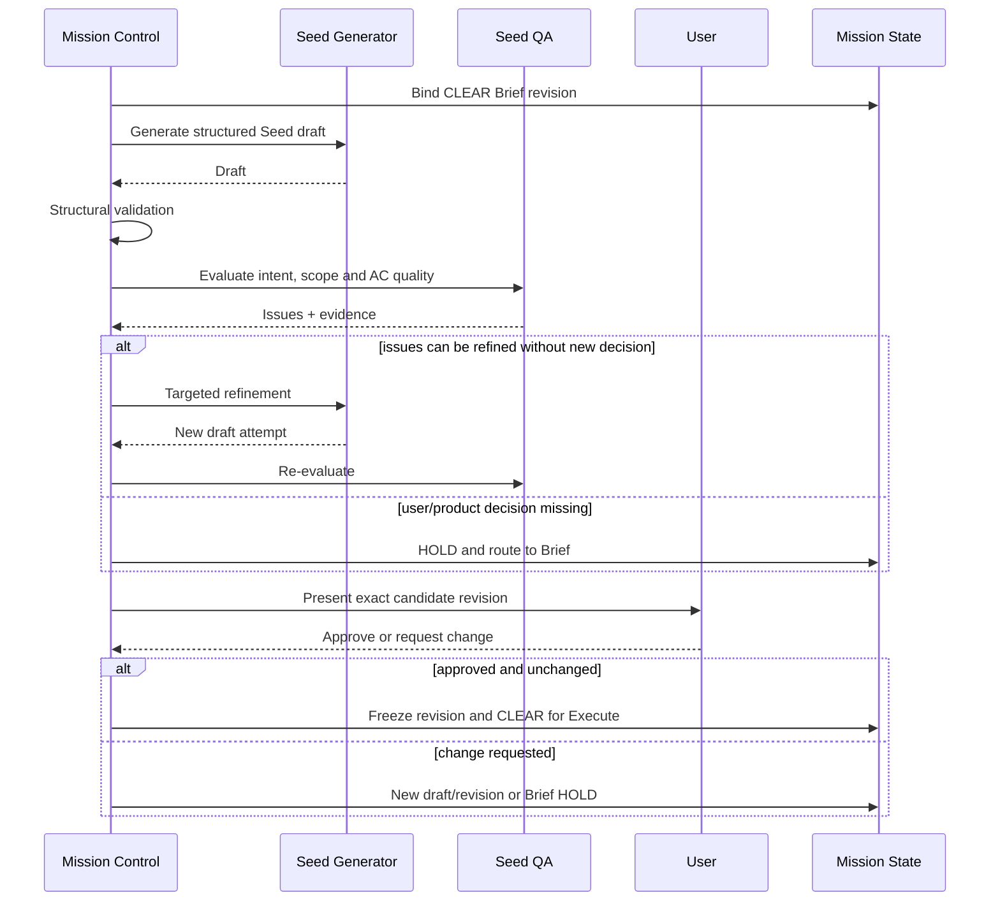

# Blueprint Stage Guide

> User-facing stage: **Blueprint**<br>
> Internal/upstream correspondence: **Seed generation, QA, refinement, approval**

| 항목 | 값 |
|---|---|
| 문서 지위 | Draft implementation guide |
| 선행 문서 | [Constitution](./00_MISSION_CONTROL.md), [Lifecycle](./02_MISSION_LIFECYCLE.md), [Brief](./05_BRIEF.md) |
| canonical CLI 명령 | `mcx blueprint generate|qa|revise|approve|gate|evolve` |
| 진입 전제 | Gen 1: `CLEAR — Clear for Blueprint` + Brief revision / Gen 2+: Verify `HOLD` + Evolve source snapshot |
| 성공 결과 | 승인된 immutable Seed revision, `CLEAR — Clear for Execute` |
| 실패 결과 | `HOLD`와 수정·질문·승인 요구사항 |

---

## 1. 목적

Blueprint는 Gen 1에서 Brief의 질문·답변·관찰·결정을, Gen 2+에서 이전
Execute·Verify evidence에 대한 Wonder/Reflect proposal을 실행과 검증이 사용할 수
있는 하나의 구조화된 specification으로 결정화한다.

```text
Brief state
  → requirement distillation
  → Seed draft
  → structural and semantic QA
  → bounded refinement
  → user approval
  → immutable approved revision
```

```text
Verify HOLD + parent Blueprint
  → Wonder → Reflect
  → successor generation proposal
  → QA + user approval
  → immutable approved revision
```

사용자에게는 Blueprint라고 부르고, 내부 artifact는 Ouroboros 대응을 위해 Seed라고
부른다.

### Blueprint가 하지 않는 일

- 코드를 구현하지 않는다.
- Runtime을 실행하지 않는다.
- 모호한 제품 결정을 자동으로 선택하지 않는다.
- 첫 LLM 출력을 자동 승인하지 않는다.
- 구현하기 쉬운 방향으로 Goal이나 AC를 바꾸지 않는다.
- 승인된 Seed를 in-place로 수정하지 않는다.
- 질문·답변의 provenance를 지우지 않는다.

---

## 2. Upstream correspondence

Mission Control은 Ouroboros의 Seed에서 다음 설계 의도를 참고했다.

- 긴 interview를 작고 구조화된 실행 specification으로 바꾼다.
- Seed는 Workflow의 방향과 완료 조건을 고정한다.
- Goal, Constraints, Acceptance Criteria, Exit Conditions가 핵심이다.
- 생성 후 검토와 보완이 필요하다.
- 승인된 Seed는 실행 중 바뀌지 않는다.

Mission Control은 학습과 scope control을 위해 Non-goals, source traceability,
revision lineage, approval evidence를 명시적으로 포함한다.

현재 upstream mapping과 아직 확인할 내용은
[Upstream Mapping](./research/UPSTREAM_MAPPING.md)과
[Open Questions](./research/OPEN_QUESTIONS.md)에 기록한다.

---

## 3. Entry Contract

Blueprint에 진입하려면 다음이 필요하다.

- Mission을 식별할 수 있다.
- 현재 Stage가 Blueprint다.
- Gen 1은 Brief의 `CLEAR — Clear for Blueprint`와 그 Brief revision을 읽을 수 있다.
- Gen 2+는 current approved Blueprint와 같은 revision의 Execute lineage,
  Verify evidence·semantic verdict, Verify Gate `HOLD`를 읽을 수 있다.
- Goal, Constraints, Non-goals, Success Criteria 또는 parent AC의 근거가 있다.
- unresolved user decision이 Gate를 무효화하지 않는다.
- Gen 1은 Brief approval provenance가 있고, Gen 2+는 source Verify snapshot이 있다.

Brief가 이후 수정되었거나 ambiguity snapshot이 stale하면 기존 CLEAR를 재사용하지
않고 Brief Gate를 다시 평가한다.

### Input identity

Gen 1 Blueprint attempt는 최소한 다음에 묶인다.

```text
mission_id
brief_revision
brief_gate_decision
blueprint_attempt_id
generator/policy/schema version
```

Gen 2+ Evolve attempt는 다음에 묶인다.

```text
mission_id
successor_generation
parent_blueprint_revision
source_verify_sequence + evidence/verdict snapshot
source_execution_attempt_numbers
wonder/reflect policy/schema version
```

---

## 4. Actors and capabilities

### Mission Control

- Brief input revision을 고정한다.
- Seed generation과 QA 역할을 분리한다.
- 구조 validation을 실행하고 exact revision에 대한 user approval record를 검증한다.
- draft/refinement/revision lineage를 지속한다.
- Blueprint Gate를 판정한다.

### Seed generator

- 제공된 Brief context를 Seed draft로 변환한다.
- 질문하지 않은 제품 결정을 발명하지 않는다.
- source와 assumption을 구분한다.
- 구조화된 결과만 반환한다.

### Wonder / Reflect producer (Gen 2+)

- Wonder는 parent ontology와 Execute·Verify evidence에서 challenge와 gap을 찾는다.
- Reflect는 explicit `keep | revise | add` AC patch와 ontology mutation을 제안한다.
- 둘 다 파일·Shell·Git·Mission Control 도구 없이 구조화된 결과만 반환한다.
- Goal·Constraints·Non-goals, parent identity, revision, approval을 결정하지 않는다.
- application이 parent AC key binding, scope와 patch 불변식을 검사해 successor
  proposal을 조립한다 ([ADR-0051](./adr/0051-evolve-successor-blueprint-contract.md)).

### Seed QA evaluator

- Goal, Constraints, Non-goals, AC, Exit Conditions의 품질을 평가한다.
- 모순, 누락, 검증 불가능한 기준을 찾는다.
- 코드를 구현하거나 Runtime을 실행하지 않는다.
- 스스로 Gate를 선언하지 않는다.

### User / Operator

- 제품 의미와 scope의 최종 권한을 가진다.
- Seed가 자신의 의도를 정확히 보존하는지 승인한다.
- 요구사항 변경이면 refinement가 아니라 Brief revision이 필요한지 결정한다.

### Capability restrictions

Blueprint generator와 QA evaluator의 기본 권한:

- 제공된 Brief state 읽기
- Seed draft/review 구조화 출력
- 필요할 때 read-only project facts 참조

Generator에 전달하는 Goals·Constraints·Non-goals·Success criteria·Context 목록은
single-line JSON array다. 빈 목록은 정확히 `[]`이며 `(none)` 같은 표시용 문장을
데이터 자리에 넣지 않는다. 2026-08-11 Codex-only 실물 실행에서 `(none)`이 실제
Non-goal로 복사되어 scope Gate가 거부한 뒤 고정한 경계다
([SEED_UPSTREAM_FINDINGS §3.5](./research/SEED_UPSTREAM_FINDINGS.md#35-empty-collection은-placeholder가-아니라-구조로-전달한다-2026-08-11)).

기본 금지:

- 파일 수정과 코드 구현
- Shell/Git 명령
- 배포·메시지·외부 쓰기
- execution Runtime 호출
- Mission Control 재귀 호출
- 승인 상태 직접 변경

Seed artifact를 저장하는 동작은 모델 tool이 아니라 Mission Control application
boundary가 수행한다.

---

## 5. Conceptual Seed schema

아래는 의미를 설명하기 위한 YAML 예시이며 최종 serialization schema가 아니다.

```yaml
seed_id: seed_example
revision: 1
generation: 1
mission_id: mission_example
source_brief_revision: brief_3
evolved_from_revision: null

goal: >
  사용자가 요청한 최종 결과와 해결할 문제.

constraints:
  - 반드시 지켜야 하는 기술·제품·운영 경계

non_goals:
  - 현재 미션에서 명시적으로 하지 않는 것

acceptance_criteria:
  - id: AC-01
    description: 관찰 가능한 결과 상태
    evidence_expectation: 결과를 어떻게 확인할지
    dependencies: []

ontology:
  name: ConfirmedRequirementContract
  description: 승인된 요구사항의 개념 경계
  fields: []

exit_conditions:
  - 미션 전체를 종료할 수 있는 검증 조건

source_refs:
  - Brief answer 또는 code/research fact reference

assumptions:
  - 아직 사실로 확정되지 않은 가정과 영향

approval:
  status: pending
  actor: null
  decided_at: null
```

정확한 필드, YAML/JSON 여부, schema version은 구현 전 확정한다.

---

## 6. Field contracts

### 6.1 Goal

Goal은 하나의 핵심 결과를 설명한다.

좋은 Goal은 다음에 답한다.

- 누구 또는 무엇을 위해 어떤 문제를 해결하는가?
- 완료 뒤 관찰할 수 있는 변화는 무엇인가?
- 이번 Mission의 경계는 어디까지인가?

Goal은 구현 방법 목록이나 마케팅 문구가 아니다.

### 6.2 Constraints

Constraints는 실행과 검증이 반드시 지켜야 하는 hard boundary다.

예:

- 기존 public API 호환성 유지
- 새 dependency 추가 금지
- 특정 data boundary 밖으로 정보 전송 금지
- 허용된 파일/서비스 범위

권장 사항과 hard constraint를 구분한다. 만족하지 않아도 되는 선호를 Constraint로
올리면 불필요한 HOLD가 생긴다.

### 6.3 Non-goals

Non-goals는 “나중에 할 수도 있는 것” 목록이 아니라 현재 Mission에서 의도적으로
제외한 결과다.

Non-goal은 Flight Controller의 선의의 범위 확장을 막고 Verify의 drift 기준이 된다.

### 6.4 Acceptance Criteria

Acceptance Criterion은 구현 작업이 아니라 완료 후 관찰할 수 있는 결과다.

좋은 AC:

- 구체적이다.
- 결과 중심이다.
- 검증 가능하다.
- Goal에 필요하다.
- 다른 AC와 중복 또는 모순되지 않는다.
- 통과와 실패를 구분할 수 있다.
- 구현 수단을 불필요하게 고정하지 않는다.

나쁜 예:

```text
"코드를 깔끔하게 작성한다"
"좋은 UX를 제공한다"
"Redux를 도입한다"
```

개선 예:

```text
"비로그인 사용자에게 댓글 작성 동작이 노출되지 않는다"
"작성 실패 시 사용자가 오류를 확인하고 다시 시도할 수 있다"
```

### 6.5 Exit Conditions

Exit Conditions는 개별 AC를 넘어 Mission 전체를 종료할 수 있는 조건이다.

예:

- 필수 AC가 모두 Verify에서 만족
- 필수 project test/build 통과
- unresolved critical risk 없음
- 필요한 사용자 acceptance 완료

Exit Condition은 Verify가 실제로 평가할 수 있어야 한다.

### 6.6 Source refs and assumptions

중요한 요구사항은 Brief answer, code fact, research evidence와 연결한다.

- `decision` authority를 가진 답변만 requirement authority를 가진다.
- `observation`은 현재 사실을 설명하지만 제품 결정을 자동 만들지 않는다.
- assumption은 명시적으로 표시하고 Gate 영향도를 기록한다.

이 규칙은 권고가 아니라 Brief handoff의 투영으로 강제된다
([ADR-0010](./adr/0010-answer-provenance-and-requirement-authority.md)).
Blueprint는 handoff의 두 채널을 다르게 사용한다.

| 채널 | 용도 |
|---|---|
| Requirement input | Goal, Constraints, Non-goals, Acceptance Criteria를 도출한다. `observation` 답변의 본문은 이 채널에 없다. |
| Observed facts | 현재 상태와 제약을 이해한다. source locator와 함께 온전히 제공된다. |

Generator는 observed facts를 읽어 제약을 이해하되, 관찰된 값을 그대로 요구사항
문장으로 옮기지 않는다. 관찰이 요구사항이 되어야 한다면 그것은 Brief로 되돌아가
사용자 결정으로 확정해야 할 항목이다.

### 6.7 Generation과 ontology

`revision`은 모든 내용 변경을 세고 `generation`은 Execute→Verify 뒤 Evolve가 연
학습 주기를 센다. 수동 QA 보완은 revision만 올리며, successor generation의 첫
revision은 `evolved_from_revision`으로 Verify가 본 parent를 가리킨다.

Ontology는 output schema가 아니라 Mission이 세대를 건너 보존할 개념과 경계다.
Gen 1은 고정된 최소 ontology(빈 fields)로 시작하고 Gen 2+의 Reflect만 명시적
`add | modify | remove` mutation을 제안한다. ontology도 Blueprint 내용이므로
QA·사용자 승인과 revision 불변성의 적용을 받는다.

---

## 7. Generation, QA, refinement, approval

### 7.1 Generation

Gen 1 Generator는 canonical Brief revision만 입력으로 사용한다. 오래된 summary나
원본 대화 transcript를 임의로 섞지 않는다.

Gen 2+ producer는 Brief를 다시 열지 않는다. current approved Blueprint,
그 revision의 Execute result, Verify evidence·semantic verdict, 이전 Evolve lineage를
Wonder→Reflect에 넣는다. 출력은 parent Blueprint를 in-place로 바꾸지 않고 후속
generation의 새 revision proposal이 된다.

출력은 parse 가능한 구조여야 하며, parse 실패를 “거의 성공”으로 저장하지 않는다.

### 7.2 Structural validation

LLM QA 전에 결정적인 검사를 수행한다.

- 필수 field 존재
- 빈 Goal 금지
- AC ID uniqueness
- 깨진 dependency reference 금지
- 잘못된 schema/version 금지
- 문자열/배열 크기 제한
- approval 기본 상태 일관성

### 7.3 Semantic QA

다음 관점을 평가한다.

- Goal이 Brief와 일치하는가?
- Constraint가 누락 또는 발명되지 않았는가?
- Non-goal이 scope를 충분히 보호하는가?
- AC가 Goal을 덮는가?
- AC가 검증 가능한가?
- AC끼리 모순·중복되지 않는가?
- Exit Conditions가 실제 완료를 판정할 수 있는가?
- unresolved assumption이 실행을 막는가?
- source refs가 요구사항 권위를 정확히 보존하는가?

QA 결과는 단일 score만이 아니라 issue list와 evidence를 제공해야 한다.

### 7.4 Refinement

Refinement는 QA issue를 해결하는 bounded rewrite다.

```text
draft
  → QA issues
  → targeted refinement
  → structural validation
  → semantic QA
```

매 round는 새 draft attempt로 기록한다. 같은 문제를 무한 반복하지 않으며 정확한
repair round 한도는 정책으로 정한다.

QA 상한은 **generation마다 5회**다. 같은 generation의 수동 revision들은 예산을
공유해 revision 반복으로 상한을 우회하지 못한다. Verify `HOLD`에서 Evolve가 다음
generation을 열 때만 새 예산이 시작된다. 상한 소진 뒤 최종 수동 수정 1회와
미달 수락도 generation별 규칙이다.

Gen 2+에서 사용자가 채택한 `blueprint revise --draft-file`은 Goal·Constraints·
Non-goals·AC와 함께 **완전한 ontology replacement**를 선택적으로 담을 수 있다.
`ontology`를 생략하면 current revision의 ontology를 그대로 보존하고, 넣으면 QA
finding까지 반영한 전체 `OntologySchema`로 교체한다. 부분 field patch는 허용하지
않는다. 빠진 field가 삭제인지 실수인지 구분할 수 없기 때문이다. 이 경로는
Reflect가 revision을 직접 고치는 우회로가 아니라, QA 제안을 사용자가 채택한 새
revision으로 만드는 기존 approval model의 일부다. Gen 1 생성은 계속 결정적인 빈
initial ontology를 사용한다.

이 계약은 pinned upstream의 interactive `skills/seed/SKILL.md`가 QA 결과에서
사용자가 수락한 변경만 이전 Seed YAML 전체에 다시 반영하는 Restate 단계와
대조했다. upstream Gen 2+ autonomous loop에는 이 정지점이 없으며, exact user
approval을 유지하는 차이는 [ADR-0051](./adr/0051-evolve-successor-blueprint-contract.md)
§6의 등록 divergence다.

### 7.5 User approval

QA 통과와 사용자 승인은 별도다.

- QA는 Seed가 실행 가능하고 일관적인지 평가한다.
- 사용자는 Seed가 실제 의도와 scope를 보존하는지 승인한다.

approval에는 actor/provenance, Seed revision, decision time을 연결한다. approval 뒤
내용이 바뀌면 approval은 stale하다.

**QA 결과는 approval이 들고 있다** (`upstream 관측`,
[ADR-0019](./adr/0019-blueprint-qa-loop.md) §8). 정책 버전, 임계값, 최선 점수,
반복 횟수, 그리고 **임계 미달 수락 여부**가 승인 기록에 남는다. Blueprint 본문에
넣지 않는 이유는 그것이 방향이고 승인 후 불변이기 때문이다 — 채점 결과를 적는
것만으로 revision이 올라가면 방향이 바뀌지 않았는데 재승인이 필요해진다.

임계 미달 수락이 상태로 남지 않으면 나중에 "이 명세가 기준을 통과한 것인가,
사용자가 미달을 수락한 것인가"를 물을 수 없다. 미달 명세에서 출발한 미션이
`MISSION COMPLETE`에 도달했을 때 그 사실이 어디에도 없으면 완료 선언의 근거가
비어 있다.

### 7.6 Evolve patch application

LLM이 반환한 index는 prompt 표시 좌표다. application은 즉시 parent AC content
key로 바꾸어 durable patch를 저장한다.

- 모든 parent AC는 정확히 한 번 `keep` 또는 `revise`된다.
- `delete`·reorder는 거부하고 `add`는 끝에만 붙인다.
- Verify 통과 + Wonder challenge 없음인 AC는 exact `keep`이다.
- `revise`는 설명만 바꾸고 explicit parent의 mechanical contract를 이어받는다.
  내용 key는 새로 계산된다.
- `add`는 설명만 가진다. mechanical contract는 후속 QA/수동 revision에서
  명시적으로 채우며, 확인 수단이 전혀 없으면 Gate가 `HOLD`한다.
- QA가 ontology 누락을 찾으면 사용자가 채택한 수동 revision에서 complete
  ontology replacement로 보완한다. 생략은 current ontology 보존을 뜻한다.
- Goal·Constraints·Non-goals 변경 proposal은 successor revision으로 적용하지
  않고 Brief 사용자 결정으로 보낸다.

`wondering`·`reflecting`·`seeding` 완료마다 같은 Blueprint 상태 문서에 checkpoint를
남긴다. 마지막 저장은 Reflect output, completed record, successor revision을 함께
원자적으로 기록한다. 자세한 계약은
[ADR-0051](./adr/0051-evolve-successor-blueprint-contract.md)이다.

### 7.7 Evolve source projection

Evolve application은 호출자가 만든 snapshot을 신뢰하지 않는다. Blueprint·
Execute·Verify durable 상태를 같은 `mission_id`로 읽어 Wonder 호출 **전에**
source를 재구성한다.

- Mission `ACTIVE` 확인과 Verify→Blueprint 전이 기록은 합성 surface가 소유한다.
  Stage service는 Mission record를 읽지 않고 저장된 Stage보다 Gate 재계산이 이긴다
  ([ADR-0037](./adr/0037-mission-record-and-canonical-stage.md) §2).
- current Blueprint revision에 exact user approval이 있다.
- 그 revision에 대해 Execute Gate를 다시 계산한 결과가 `CLEAR`다.
- Verify evidence와 semantic assessment가 current revision을 가리킨다.
- evidence의 execution attempt 번호는 Execute state에 있는 current revision의
  성공 attempt 번호 전체와 순서까지 같다.
- mechanically verifiable AC마다 mechanical run이 정확히 하나, 모든 AC마다
  semantic verdict가 정확히 하나 있으며 unknown key도 없다.
- 위 객체와 현재 semantic policy로 Verify Gate를 다시 계산한 결과가 `HOLD`다.

projection은 `VerifyState.sequence`를 `source_verify_sequence`로, evidence의
attempt 번호를 source lineage로 쓴다. AC별 snapshot은 mechanical run의 pass와
결정적 실패 이유, semantic verdict의 pass·score·uncertainty·reward-hacking
risk·reasoning, 원문 output reference와 semantic evidence reference를 담는다.
`proven`은 별도 계산을 만들지 않고 Verify Gate와 같은 `proven_criteria()` 결과를
쓴다.

따라서 application 단위가 직접 거부하는 terminal 입력은 Verify Gate `CLEAR`다.
Mission record의 `COMPLETE`는 이후 CLI/MCP surface가 service 호출 전에 거부한다.
이 분리는 완료 Mission을 다시 연다는 뜻이 아니라, 합성 상태의 enforcement를
Stage service에 복제하지 않는다는 뜻이다.

이 exact projection은 upstream이 다음 generation을 대화 기억이 아니라 완료
event의 Seed·execution output·evaluation summary에서 재구성하고, 불완전한 phase를
fail-closed하는 의도를 파일 상태에 옮긴 것이다
([EVOLVE findings §7~§8](./research/EVOLVE_UPSTREAM_FINDINGS.md)).

### 7.8 Wonder/Reflect text adapter

두 역할은 기존 vendor-neutral `CompletionEngine.complete_json()`을 workspace 없이
호출한다. 따라서 Claude 기본 lane은 빈 tool catalog·빈 MCP·빈 setting sources를
강제하며, adapter는 파일을 읽거나 수정하지 않는다
([ADR-0036](./adr/0036-claude-text-lane-contract.md),
[backend A/B §6~§7](./research/EVOLVE_BACKEND_AB.md)). Hermes는 최초 범위에 없다.

Wonder prompt는 parent 방향·AC·ontology, AC별 source outcome·evidence, Verify Gate
blocker, 이전 Wonder lineage를 담는다. 응답의 challenge는 upstream과 같은 1-based
`ac_refs`를 쓰고 gap은 빈 refs를 쓴다. adapter는 범위 밖·빈 challenge ref와 ref가
붙은 gap을 거부하고, 유효 ref를 즉시 parent AC content key로 바꾼다. index는
durable `WonderOutput`에 남지 않는다.

Reflect prompt는 같은 parent/source에 Wonder output을 더하며 upstream과 같은
0-based parent `index` patch를 받는다. strict JSON schema에서 모든 property를
필수로 유지하기 위해 `add`의 index는 transport-only `-1`, `keep`의 content와
`remove` ontology mutation의 field payload는 빈 문자열 sentinel을 쓴다. adapter는
다음을 결정적으로 적용한 뒤에만 durable `ReflectOutput`을 반환한다.

- 모든 parent index가 순서대로 정확히 한 번 `keep | revise`되고 add는 뒤에만 온다.
- protected AC(Verify proven + Wonder challenge 없음)의 revise는 exact keep으로
  되돌린다. settled key도 모델에게 받지 않고 proven·unchallenged keep에서 계산한다.
- index와 settled 좌표는 즉시 content key로 바꾼다.
- add/modify ontology mutation은 replacement field의 name·type·description·required를
  전부 요구하고, remove는 target name만 사용한다.
- 현재 ontology에 적용할 수 없는 add/modify/remove는 checkpoint 전에 거부한다.

schema·index·ontology validation 실패는 phase output으로 저장하지 않는다. 다음 Core
호출은 아직 완료되지 않은 같은 Wonder 또는 Reflect phase를 다시 시도할 수 있다.
이는 upstream의 grounded Wonder parser·explicit patch identity·satisficing backstop을
우리 content-key 경계에 옮긴 것이다
([EVOLVE findings §4~§5](./research/EVOLVE_UPSTREAM_FINDINGS.md), pinned
`evolution/wonder.py`, `evolution/reflect.py`).

### 7.9 CLI/MCP surface

명시적 진입은 `mcx blueprint evolve`다. Evolve가 새 Stage가 아니고 결과가
Blueprint proposal이므로 최상위 `evolve` 명령은 만들지 않는다. composition은
Blueprint text lane 하나를 Wonder/Reflect가 공유하게 조립하고, surface가 Mission
record의 존재와 `ACTIVE`만 먼저 확인한다. stored Stage는 진입 권한이 아니며 실제
자격은 application의 Blueprint·Execute·Verify Gate 재계산이 결정한다.

successor revision이 생기면 exit 0으로 revision·generation·approval 필요를
표시하고 Mission record를 Blueprint로 전이한다. scope change finding만 생기면
exit 2 `HOLD`로 반환하며 revision·전이는 없다. MCP는 같은 parser와 dispatch에서
`mcx_blueprint_evolve`를 파생하고, Wonder+Reflect 두 primary call을 기다릴 수 있게
`mcx_start_blueprint_evolve` 비동기 짝을 제공한다.

Blueprint state 저장과 Mission record 전이는 cross-file transaction이 아니다.
successor 저장 뒤 전이 기록 전에 중단되면 `status` mismatch가 드러나고 Gate
재계산이 이긴다 ([ADR-0037](./adr/0037-mission-record-and-canonical-stage.md),
[ADR-0051](./adr/0051-evolve-successor-blueprint-contract.md) §10).

---

## 8. Normal sequence



### Detailed steps

1. Brief Gate와 input revision을 검증한다.
2. Blueprint attempt를 생성한다.
3. requirement distillation을 준비한다.
4. Seed draft를 생성한다.
5. 구조 validation을 실행한다.
6. semantic QA를 실행한다.
7. issue를 specification gap과 refinable defect로 분류한다.
8. refinable issue만 bounded refinement한다.
9. 필요한 경우 Brief로 질문을 돌린다.
10. candidate revision을 사용자에게 제시한다.
11. 승인된 exact content를 freeze한다.
12. approval evidence와 revision lineage를 지속한다.
13. Gate가 `CLEAR — Clear for Execute` 또는 `HOLD`를 기록한다.

### Gen 2+ Evolve sequence

1. surface가 Mission `ACTIVE`를 확인하고 `blueprint evolve` 단발 명령을 연다.
2. current approved Blueprint와 같은 revision의 Execute·Verify lineage를 검증한다.
3. Verify Gate가 `HOLD`인지 재계산하고 source snapshot을 저장한다.
4. Wonder output을 저장한다.
5. Reflect output을 저장한다.
6. parent AC key binding, protected keep, delete/reorder 금지, scope 보존을 검사한다.
7. successor generation의 pending revision과 completed evolution record를 원자 저장한다.
8. surface가 Mission Stage를 Blueprint로 기록한다.
9. QA와 사용자 승인을 거쳐 Gate를 다시 판정한다.

정상 호출 예산은 Wonder 1 + Reflect 1 = **2 primary calls**다. 기존 Claude
transient retry 상한을 포함하면 phase당 3 attempts, 전체 최악 6회다.

---

## 9. Immutability and revisions

승인된 Seed는 in-place로 바꾸지 않는다.

```text
Seed revision 1 — approved
  └─ semantic change requested
      → Seed revision 2 — pending QA/approval
```

### Revision을 요구하는 변경

- Goal 변경
- Constraint/Non-goal 추가·삭제·의미 변경
- AC 추가·삭제·의미 변경
- Exit Condition 변경
- 중요한 source authority 변경
- 검증 방법이 완료 의미를 바꾸는 변경

오탈자처럼 의미를 바꾸지 않는 editorial change를 같은 revision metadata 수정으로
허용할지는 TBD다. 기본값은 안전하게 새 revision을 만드는 것이다.

### Downstream invalidation

새 Seed revision이 승인되면 이전 revision의 Execute/Verify evidence를 자동 재사용하지
않는다. 어떤 evidence를 재사용할 수 있는지 명시적으로 증명하고 기록해야 한다.

---

## 10. Blueprint Gate

### `CLEAR — Clear for Execute`

다음 조건을 모두 만족해야 한다.

- exact input lineage가 있다: Gen 1은 Brief revision, Gen 2+는 parent Blueprint
  revision과 source Verify snapshot이 있다.
- structure validation이 통과한다.
- Goal이 명확하고 Brief와 일치한다.
- Constraints와 Non-goals가 충돌하지 않는다.
- 모든 필수 AC가 구체적이고 검증 가능하다.
- Exit Conditions가 평가 가능하다.
- 실행을 바꾸는 unresolved assumption이 없다.
- QA blocker가 없다.
- 사용자가 exact Seed revision을 승인했다.
- approval 이후 content가 바뀌지 않았다.
- Evolve proposal이면 generation/parent lineage와 ontology가 구조적으로 유효하다.

### `HOLD`

다음 중 하나면 기본적으로 HOLD한다.

- Brief Gate 또는 revision이 stale함
- Evolve source Verify snapshot이 없거나 current parent revision과 어긋남
- 구조 parse/validation 실패
- Goal/Constraint/Non-goal 충돌
- 필수 AC 누락
- AC가 구현 수단만 설명하거나 검증 불가능함
- Exit Condition 없음 또는 평가 불가능
- generator가 Brief에 없는 요구사항을 발명함
- Reflect가 Goal·Constraint·Non-goal 변경을 제안함 — Brief 사용자 결정 필요
- unresolved assumption이 실행 결과를 바꿈
- QA issue가 반복되며 progress가 없음
- user approval 없음 또는 거절
- approval 뒤 content 변경

HOLD는 issue, source reference, 필요한 질문/수정, 다음 목적지를 포함한다.

---

## 11. Failure and recovery

| 실패 | 기본 처리 |
|---|---|
| Seed parse 실패 | 원본 output 보존, bounded regeneration |
| 필수 field 누락 | structural HOLD 또는 targeted refinement |
| Brief에 없는 제품 결정 생성 | 제거하고 Brief authority 확인 |
| user decision 누락 | Brief HOLD |
| AC 품질 부족 | QA issue 기반 refinement |
| Constraint 충돌 | Brief/Blueprint owner에 따라 HOLD |
| refinement 무진전 | 자동 loop 중단, HOLD |
| approval 거절 | feedback 분류 후 새 revision 또는 Brief |
| 저장 실패 | CLEAR 금지, durable state 복구 |
| approved content mutation | violation 기록, 새 revision 요구 |

Blueprint의 repair와 실행 결과의 Recover를 구분한다. Seed QA/refinement는 아직
실행 전 authoring loop이며 `mcx recover`의 구현 교정과 같은 Stage가 아니다.

---

## 12. Persistence and Telemetry

Blueprint 과정은 최소한 다음을 보존한다.

- input Brief revision과 Gate
- generator backend/policy/schema version
- draft attempts와 parse result
- structural validation issues
- semantic QA issues와 evidence
- refinement instruction과 결과
- unresolved assumption
- candidate content hash 또는 identity
- user approval/denial provenance
- approved Seed revision과 lineage
- final GateDecision

승인된 Seed와 approval record는 원자적으로 연결되어야 한다. Seed는 저장되고
approval만 유실되거나, approval은 기록되고 content가 유실된 상태를 CLEAR로
간주하지 않는다.

---

## 13. CLI experience

확정된 command 외 옵션은 정의하지 않는다.

```text
$ mcx blueprint

Mission: <mission id>
Source Brief: <revision>
Stage: BLUEPRINT

Generating Seed draft...
Structural validation: PASS
Semantic QA: PASS

Goal: <summary>
Constraints: <count>
Non-goals: <count>
Acceptance Criteria: <count>
Exit Conditions: <count>

Approval required for revision <revision id>.
```

승인과 사용자 입력 UX는 아직 결정하지 않았으므로 가상의 flag를 만들지 않는다.

CLEAR 예시:

```text
CLEAR — Clear for Execute
Blueprint: <approved revision>
Next: mcx execute
```

HOLD 예시:

```text
HOLD — Acceptance Criterion is not verifiable

Criterion:
  <description>

Problem:
  No observable pass/fail condition is defined.

Next action:
  Refine the criterion or return to Brief for a product decision.
```

---

## 14. Test matrix

> **upstream 근거 표시.** 이 표의 원본은 Blueprint upstream 조사
> ([SEED_UPSTREAM_FINDINGS](./research/SEED_UPSTREAM_FINDINGS.md)) **이전에**
> 작성됐다. 따라서 **표시가 없는 행은 upstream과 개별 대조되지 않았다.** 검증된
> 계약으로 읽지 말 것. 새 행을 추가할 때는 근거를 시나리오 칸에 함께 적는다 —
> 대응물이 없으면 `upstream 대응물 없음`과 등록 ADR을, 소스가 아니라 실행
> 관측이면 `upstream 관측`을, 확인하지 못했으면 `upstream 미확인`을 남긴다.

| 영역 | 시나리오 | 기대 결과 |
|---|---|---|
| Entry | Brief CLEAR 없음 | generation 없이 HOLD |
| Entry | stale Brief revision | 재평가 요구 |
| Evolve entry | Verify `CLEAR` 또는 `MISSION COMPLETE` (`upstream 대응물 없음`, [ADR-0051](./adr/0051-evolve-successor-blueprint-contract.md) §1) | LLM 호출 전 거부; 완료 Mission을 다시 열지 않음 |
| Evolve entry | current revision의 Execute/Verify snapshot 누락 (`upstream 관측`, [EVOLVE findings](./research/EVOLVE_UPSTREAM_FINDINGS.md) §7~§8) | successor를 만들지 않고 HOLD |
| Evolve entry | evidence attempt 번호가 current Execute lineage와 다름 (`upstream 관측`, 위 findings §7~§8) | 오래되거나 일부인 snapshot으로 Wonder를 호출하지 않음 |
| Evolve entry | mechanical AC run 또는 AC별 semantic verdict 누락·unknown key (`upstream 관측`, 위 findings §8) | 불완전한 source를 저장하지 않고 HOLD |
| Wonder adapter | challenge의 1-based AC ref가 빈 값·범위 밖이거나 gap에 ref가 붙음 (`upstream 관측`, pinned `evolution/wonder.py`) | phase output을 저장하지 않고 같은 Wonder phase 유지 |
| Reflect adapter | parent index 누락·중복·재정렬 또는 add가 중간에 있음 (`upstream 관측`, [EVOLVE findings](./research/EVOLVE_UPSTREAM_FINDINGS.md) §4) | content key 변환 전 거부; unsafe patch checkpoint 금지 |
| Reflect adapter | protected AC를 revise (`upstream 관측`, pinned `evolution/reflect.py` satisficing backstop) | adapter가 exact keep으로 되돌리고 settled key를 결정적으로 계산 |
| Reflect adapter | 존재하지 않는 ontology field modify/remove 또는 기존 field add (`upstream 관측`, 위 findings §5) | phase output 저장 전 거부 |
| Evolve surface | Mission record 없음 또는 `COMPLETE` (`upstream 대응물 없음`, [ADR-0051](./adr/0051-evolve-successor-blueprint-contract.md) §10) | service·LLM 호출 전에 exit 1; terminal Mission을 다시 열지 않음 |
| Evolve surface | Reflect scope finding으로 successor revision 없음 (`upstream divergence`, 위 ADR §5·§10) | exit 2 `HOLD`; Mission Stage를 Verify에 유지하고 Brief 사용자 결정 안내 |
| Evolve surface | valid successor + MCP 호출 (`upstream 대응물 없음`, 위 ADR §10) | CLI와 같은 dispatch로 revision 1개·Verify→Blueprint 전이·Completion 2회 원장 기록 |
| Evolve replay | Wonder 저장 뒤 process 중단 (`upstream 관측`, 위 findings §8) | 같은 successor generation에서 Reflect부터 재개 |
| Evolve concurrency | 같은 parent에 동시 호출 (`upstream 관측`, 위 findings §10) | single-flight; successor revision 하나만 생성 |
| Generation | valid structured draft | QA로 진행 |
| Generation | malformed output | parse failure, CLEAR 금지 |
| Structure | duplicate AC IDs | validation HOLD |
| Structure | broken dependency | validation HOLD |
| Intent | Brief에 없는 기능 추가 | invented requirement로 HOLD |
| Scope | Non-goal을 AC에 포함 | contradiction HOLD |
| AC quality | 관찰 불가능한 AC | QA issue |
| AC quality | 구현 방법만 지정 | 결과 조건으로 refinement |
| Refinement | issue 해결 | 새 draft attempt, 재검증 |
| Refinement | 동일 issue 반복 | bounded loop 종료와 HOLD |
| QA loop | 총점 동점, 축 점수 다름 (`upstream 관측`, [ADR-0019](./adr/0019-blueprint-qa-loop.md) §5) | 축별 평균이 높은 시도가 best. 총점만 보면 더 나은 명세를 버린다 |
| QA loop | 상한 도달, 마지막 채점이 통과 (`upstream 미확인`) | `DONE`. 횟수를 다 썼다는 이유로 합격을 취소하지 않는다 |
| Approval | QA 통과, 승인 없음 | Execute 금지 |
| Approval | 임계 미달을 사용자가 수락 (`upstream 관측`, [ADR-0019](./adr/0019-blueprint-qa-loop.md) §8) | 승인 기록에 점수·임계값·정책 버전·수락 사실이 남는다. Blueprint 본문은 바뀌지 않는다 |
| Approval | 점수가 임계 미만인데 수락 표시 없음 (`upstream 대응물 없음`, [ADR-0019](./adr/0019-blueprint-qa-loop.md) §8) | 승인 거부. 통과하지 못한 명세가 통과한 것으로 기록되면 이후 모든 Gate의 전제가 거짓이 된다 |
| Approval | exact revision 승인 | immutable revision 생성 |
| Mutation | 승인 뒤 content 변경 | approval stale, 새 revision |
| Persistence | Seed 저장 실패 | CLEAR 금지 |
| Traceability | source ref 없음 | policy에 따른 issue/HOLD |
| Revision | 새 Seed 승인 | 이전 downstream evidence 자동 재사용 금지 |
| Evolve patch | explicit keep/revise/add (`upstream 관측`, 위 findings §4, focused tests 2 passed) | 모든 parent key를 한 번씩 매핑; revise는 mechanical contract 보존 + 새 key, add는 빈 contract |
| Evolve patch | delete/reorder/unknown·duplicate parent (`upstream 관측`, 위 findings §4) | successor revision 생성 거부 |
| Evolve scope | refined goal/constraints가 parent와 다름 (`upstream divergence`, [ADR-0051](./adr/0051-evolve-successor-blueprint-contract.md) §5) | proposal finding을 보존하고 Brief 사용자 결정 요구 |
| Evolve refinement | QA가 ontology 누락을 지적하고 사용자가 보완안을 채택 (`upstream interactive Seed Restate 관측`, pinned `skills/seed/SKILL.md`; Gen 2+ 정지점은 [ADR-0051](./adr/0051-evolve-successor-blueprint-contract.md) §6 divergence) | manual draft의 complete ontology가 새 revision을 교체하며, 생략 시 current ontology 보존 |
| QA budget | 같은 generation의 manual revision | 남은 5회 예산 공유; revision으로 우회 불가 |
| QA budget | Verify `HOLD` 뒤 Evolve successor generation | 새 generation QA 예산 시작 |

### Property-style invariants

- 승인된 Seed object의 의미 field는 변경되지 않는다.
- 모든 Execute attempt는 approved Seed revision을 참조한다.
- approval content identity와 저장 Seed identity가 일치한다.
- invalid Seed는 serialization 성공만으로 승인되지 않는다.
- QA evaluator output은 GateDecision이 아니다.

---

## 15. Implementation slices

### Slice 1 — Seed domain model

- 최소 field와 validation을 정의한다.
- immutable approved representation을 테스트한다.
- revision lineage를 테스트한다.

### Slice 2 — Deterministic structural validation

- LLM 없이 missing/duplicate/broken references를 검사한다.
- validation issue model을 정의한다.

### Slice 3 — Fake generator and QA

- valid, malformed, invented, contradictory fixtures를 만든다.
- bounded refinement state machine을 테스트한다.

### Slice 4 — Bounded text backend

- tool-less structured generation contract를 연결한다.
- parse failure와 timeout을 테스트한다.

### Slice 5 — Approval and freeze

- exact content identity를 사용자 decision과 연결한다.
- approval 후 mutation을 거부한다.

### Slice 6 — `mcx blueprint`

- Core application boundary를 호출한다.
- draft summary, QA issues, approval requirement, Gate를 표시한다.
- CLI 자체에서 Seed를 생성하거나 승인하지 않는다.

---

## 16. Implementation checklist

- [ ] Brief revision binding을 정의했다.
- [ ] Seed 최소 schema를 정의했다.
- [ ] Goal/Constraint/Non-goal 의미를 validation에 반영했다.
- [ ] AC quality rubric을 정의했다.
- [ ] Exit Condition validation을 정의했다.
- [ ] source refs와 assumption을 보존한다.
- [ ] structural validation은 LLM 없이 실행된다.
- [ ] generator와 QA 역할을 분리했다.
- [ ] bounded refinement attempt를 지속한다.
- [ ] user approval과 QA pass를 분리했다.
- [ ] exact content identity를 approval에 연결했다.
- [ ] 승인 Seed in-place mutation을 차단했다.
- [ ] revision lineage를 보존한다.
- [ ] stale Brief/approval을 감지한다.
- [ ] Execute가 승인 revision 없이 시작되지 않음을 테스트했다.
- [ ] upstream 관찰을 research 문서에 기록했다.
- [ ] 의도적 차이를 Stage의 divergence ADR에 등록했다. 확인하지 못한
      항목은 미확인으로 같은 곳에 적었다.

---

## 17. Learning questions

1. 왜 Interview transcript를 그대로 Execute에 넘기지 않는가?
2. QA pass와 사용자 approval은 왜 별개인가?
3. Acceptance Criterion과 구현 task의 차이는 무엇인가?
4. Non-goal이 Verify에서 어떤 역할을 하는가?
5. Seed를 실행 중 수정하면 왜 evidence chain이 깨지는가?
6. score 하나보다 QA issue list가 중요한 이유는 무엇인가?
7. 제품 결정 누락을 generator가 채우면 어떤 authority 문제가 생기는가?
8. 새 revision에서 이전 evidence를 기본 재사용하면 왜 위험한가?

---

## 18. Open decisions

- ~~canonical Seed serialization~~ → mission당 단일 JSON 문서
  ([ADR-0021](./adr/0021-blueprint-state-and-revisions.md) §1). schema version
  필드는 미정
- ~~필수/선택 field와 ontology 포함 여부~~ →
  방향 필드는 [ADR-0017](./adr/0017-blueprint-schema-baseline.md), ontology 유예는
  실제 소비자가 생긴 [ADR-0051](./adr/0051-evolve-successor-blueprint-contract.md) §3에서 해소
- Seed에 기록할 source reference의 concrete schema (authority rule 자체는 [ADR-0010](./adr/0010-answer-provenance-and-requirement-authority.md)에서 확정)
- AC dependency를 Seed에 포함할지 Execute에서 파생할지
- ~~AC quality rubric과 QA score 사용 여부~~ →
  [ADR-0019](./adr/0019-blueprint-qa-loop.md)
- ~~refinement attempt budget~~ → generation마다 최대 5회, 같은 generation의
  revision들이 durable 예산을 공유
  ([ADR-0019](./adr/0019-blueprint-qa-loop.md) §2,
  [ADR-0051](./adr/0051-evolve-successor-blueprint-contract.md) §7)
- approval UX와 actor identity
- ~~revision ID 생성 방식~~ → 1부터 연속 정수
  ([ADR-0021](./adr/0021-blueprint-state-and-revisions.md) §2). Evolve generation은
  별도 연속 정수이며 `(mission_id, generation)`이 identity
  ([ADR-0051](./adr/0051-evolve-successor-blueprint-contract.md) §2). content hash는
  미정 — 최선 시도 채택 절차가 내용 동일성 판정을 요구할 때 확정한다
- editorial change와 semantic revision 구분
- user-authored Seed import/edit 지원 여부
- 이전 revision evidence 재사용 조건
- ~~Seed 저장 위치와 atomic approval transaction~~ → 같은 문서의 원자 교체
  ([ADR-0021](./adr/0021-blueprint-state-and-revisions.md) §1)

결정은 Ouroboros source/test 조사와 Mission Control failure fixture를 함께 근거로 삼아
ADR에서 확정한다.

---

## Exit statement

Blueprint의 성공은 문서가 생성되었다는 뜻이 아니다.

> **The user’s intent has been distilled into an internally consistent,
> verifiable, approved, and immutable Seed revision that can govern execution
> without requiring a Flight Controller to invent product decisions.**
