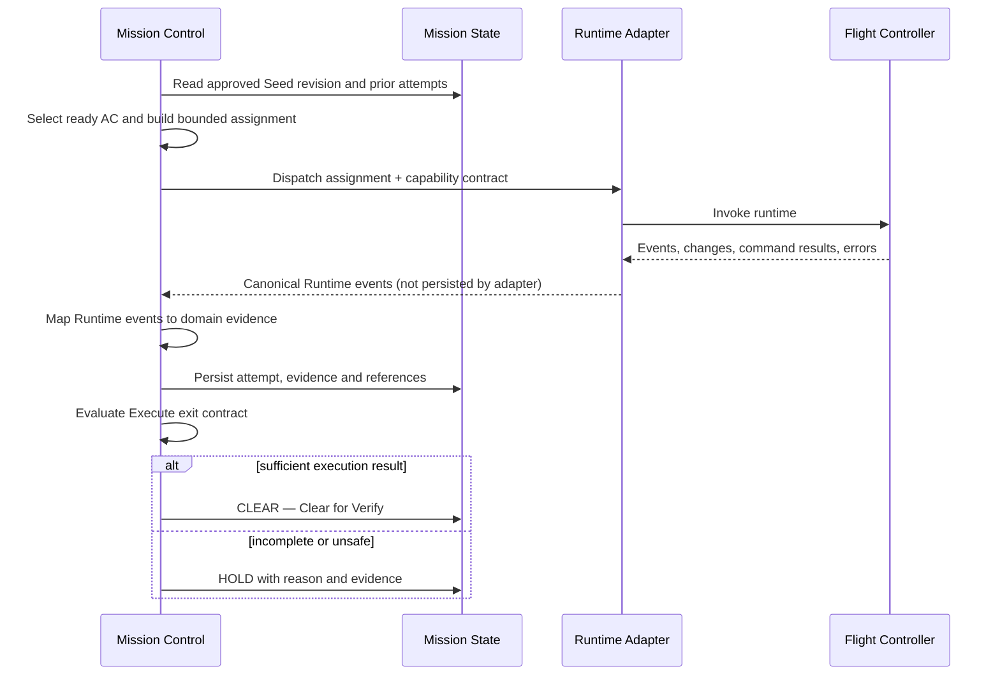

# Execute Stage Guide

> User-facing stage: **Execute**<br>
> Internal/upstream correspondence: **Run / execution orchestration**

| 항목 | 값 |
|---|---|
| 문서 지위 | Draft implementation guide |
| 선행 문서 | [Constitution](./00_MISSION_CONTROL.md), [Architecture](./01_ARCHITECTURE.md), [Mission Lifecycle](./02_MISSION_LIFECYCLE.md), [Runtime](./03_RUNTIME.md), [Blueprint](./06_BLUEPRINT.md) |
| 계획된 canonical CLI 명령 | `mcx execute` — 명칭 확정, 아직 미구현 |
| 진입 전제 | 승인된 Blueprint/Seed revision |
| 성공 시 목적지 | `CLEAR — Clear for Verify` |
| 내부 산출물 상태 | 실행됨, 아직 공식 검증되지 않음 |

---

## 1. 목적

Execute는 승인된 Blueprint를 Flight Controller가 수행할 수 있는 **범위가 제한된
실행 계약**으로 바꾸고, Runtime Adapter를 통해 실행한 뒤, Verify가 판정할 수
있는 Telemetry를 수집하는 Stage다.

Execute의 목표는 “에이전트에게 프로젝트를 맡긴다”가 아니다.

```text
Approved Blueprint
  → Acceptance Criterion에 추적되는 작업
  → 명시된 권한과 파일 범위
  → Runtime dispatch
  → 실행 결과와 Telemetry
  → executed, unverified
```

### Execute가 하지 않는 일

- 제품 요구사항을 새로 결정하지 않는다.
- 승인된 Blueprint를 조용히 수정하지 않는다.
- Flight Controller에게 무제한 저장소 권한을 주지 않는다.
- 에이전트의 “완료” 보고를 검증 완료로 바꾸지 않는다.
- Verify의 독립 판정을 대신하지 않는다.
- 실패한 작업을 무한 반복하지 않는다.
- 편의를 위해 Mission Control을 재귀적으로 다시 호출하지 않는다.

---

## 2. Upstream correspondence

Mission Control의 Execute는 Ouroboros의 `Run`과 execution/orchestrator 개념을
학습용으로 경량 재구성한다.

유지할 핵심 의도는 다음과 같다.

- Seed를 실행의 방향으로 사용한다.
- Acceptance Criteria를 실행과 검증의 추적 단위로 사용한다.
- 작업 간 의존성을 고려한다.
- 실행 Runtime을 Workflow Core와 분리한다.
- 실제 실행 결과를 검증 완료와 분리한다.
- 실패 증거를 다음 시도에 전달한다.

원본의 병렬 실행, 다단계 분해, 모델 라우팅, 고급 회복 전략을 처음부터 모두
복제하지 않는다. 먼저 단일 Runtime과 순차 실행으로 상태 전이와 증거 계약을
검증한 뒤, 원본과 차이를 기록하면서 확장한다.

현재 upstream 조사 기준과 파일 대응은
[Upstream Mapping](./research/UPSTREAM_MAPPING.md)에 기록한다.

---

## 3. Entry Contract

Execute에 진입하려면 다음 조건이 모두 필요하다.

- Mission이 존재한다.
- 현재 Stage가 Execute 진입을 허용한다.
- `CLEAR — Clear for Execute` Gate decision이 존재한다.
- 승인된 Blueprint/Seed revision이 존재한다.
- Blueprint가 현재 Mission과 연결되어 있다.
- Goal, Constraints, Non-goals, Acceptance Criteria, Exit Conditions가 읽힌다.
- 실행 대상 작업공간과 사용 권한이 명확하다.
- 선택한 Runtime이 필요한 capability를 제공한다.
- 이전 실행을 재개하는 경우 attempt와 Runtime handle을 식별할 수 있다.

하나라도 확인할 수 없으면 실행을 시작하지 않고 `HOLD`한다.

### Blueprint revision binding

모든 Execute attempt는 정확히 하나의 승인된 Blueprint revision에 고정된다.

```text
mission_id
seed_revision
execute_attempt
```

실행 중 요구사항을 바꿔야 한다면 같은 attempt에서 Seed를 수정하지 않는다.
현재 실행을 중단하고 Blueprint revision 절차로 돌아간다.

---

## 4. Actors and responsibilities

### Mission Control

- 실행 가능한 Acceptance Criteria를 선택한다.
- 의존성과 이전 상태를 확인한다.
- 작업 범위와 capability를 결정한다.
- Runtime Adapter를 선택하고 dispatch한다.
- Runtime Adapter의 canonical Runtime event를 domain evidence로 매핑한다.
- repository를 통해 attempt 상태, evidence와 결과를 지속한다.
- Execute Gate를 판정한다.

### Flight Controller

- 전달받은 하나의 제한된 실행 계약을 수행한다.
- Goal과 관련 Constraints/Non-goals를 지킨다.
- 허용된 파일과 도구만 사용한다.
- 변경, 명령, 오류, 관찰 결과를 반환한다.
- 수행 불가능하거나 지나치게 큰 작업은 증거와 함께 보고한다.

### Runtime Adapter

- 공통 dispatch를 런타임 호출로 변환한다.
- provider transport secret을 제거하고 세션, stream, 종료, 오류를 canonical Runtime
  event와 공통 결과로 정규화한다.
- Runtime 고유 권한 모델을 capability contract에 연결한다.
- Mission state나 domain evidence를 직접 persist하지 않는다.
- Stage나 Gate를 결정하지 않는다.

### User / Operator

- 추가 권한이나 범위 변경이 필요할 때 결정한다.
- 파괴적 행동 또는 외부 시스템 변경을 별도로 승인한다.
- Blueprint 변경이 필요한 제품 결정을 승인한다.

---

## 5. Capability Contract

Execute는 파일 읽기·수정과 명령 실행이 필요할 수 있지만, 이것이 무제한 권한을
뜻하지 않는다.

### Dispatch마다 명시할 항목

```text
role
goal
acceptance criterion
constraints
non-goals
workspace
read scope
write scope
allowed tools
denied actions
external side-effect policy
time/attempt budget
required telemetry
```

### 기본 권한 정책

- 저장소 읽기: 작업에 필요한 범위에서 허용
- 파일 쓰기: 명시된 workspace와 scope 안에서만 허용
- Shell: 검증 및 구현에 필요한 명령만 허용
- Git diff/status: 관찰 용도로 허용 가능
- Commit, push, PR, 배포: 별도 승인 없이는 금지
- 네트워크 쓰기, 메시지 전송, 외부 데이터 변경: 별도 승인 없이는 금지
- Mission Control MCP 재호출: 금지
- Blueprint 또는 Mission state 직접 수정: 금지

정확한 allowlist 표현은 Runtime 문서와 Security ADR에서 확정한다.

---

## 6. Work derivation

### 6.1 Acceptance Criterion first

작업은 승인된 Acceptance Criterion에 추적되어야 한다.

```text
AC-01
  └─ Execute unit EU-01
       ├─ input context
       ├─ permitted scope
       └─ evidence contract
```

하나의 작업이 여러 AC를 동시에 변경할 수는 있지만, 결과 Telemetry는 각 AC에
어떤 영향을 주었는지 분리해서 설명해야 한다.

### 6.2 Atomic-first decomposition

처음부터 모든 AC를 지나치게 작은 작업으로 분해하지 않는다.

1. AC가 하나의 제한된 작업으로 수행 가능한지 평가한다.
2. 가능하면 그대로 실행한다.
3. 실제 의존성, 범위, 증거와 함께 너무 크다고 판단될 때만 분해한다.
4. 분해된 작업은 원래 AC로 다시 추적되어야 한다.
5. 분해 깊이와 개수는 bounded해야 한다.

정확한 크기 판단과 분해 한도는 구현 전 ADR로 확정한다.

### 6.3 Dependency ordering

각 작업은 선행 조건을 가진다.

```text
EU-01 API contract
  ├─ EU-02 persistence
  └─ EU-03 UI integration
       └─ EU-04 error behavior
```

선행 작업이 검증되지 않았다는 이유만으로 모든 실행을 막을 필요는 없지만,
의존 artifact가 존재하지 않거나 명백히 실패한 상태에서 후속 작업을 실행해서는
안 된다.

### 6.4 v1 execution baseline

첫 구현은 순차 실행을 기본값으로 삼는다.

- 상태 전이와 Telemetry 계약을 먼저 검증한다.
- 병렬성 때문에 생기는 파일 충돌과 결과 병합 문제를 피한다.
- 병렬 실행은 독립성과 merge 정책이 문서화된 뒤 도입한다.

이는 영구적인 제한이 아니라 검증 가능한 최소 구현 순서다.

---

## 7. Provisional data contracts

아래 구조는 의미를 설명하기 위한 초안이며 최종 Python API가 아니다.

Execute start처럼 side effect가 있는 application command는 application-command
boundary에서 idempotency key를 반드시 검증한다. application/Core가 기존 결과 반환,
payload conflict와 새 attempt 생성 의미를 소유한다. Runtime Adapter에는 파생 key/token을
전달할 수 있지만 exact key schema, store와 보존 기간은 **TBD**다.

```python
class ExecutionAssignment:
    mission_id: str
    seed_revision: str
    attempt_id: str
    criterion_ids: tuple[str, ...]
    objective: str
    constraints: tuple[str, ...]
    non_goals: tuple[str, ...]
    dependencies: tuple[str, ...]
    workspace: str
    capabilities: object
    previous_failure_refs: tuple[str, ...]
    telemetry_requirements: object


class ExecutionResult:
    attempt_id: str
    runtime_handle: object | None
    outcome: str
    changed_artifacts: tuple[object, ...]
    command_results: tuple[object, ...]
    observations: tuple[object, ...]
    errors: tuple[object, ...]
```

### 결과 상태의 의미

정확한 enum은 Lifecycle 문서에서 확정하지만 최소한 다음 의미를 구분해야 한다.

- 대기 중
- 실행 중
- 실행됨, 미검증
- 실행 자체 실패
- 취소됨
- Runtime 결과를 잃어 상태를 알 수 없음

“실행됨, 미검증”과 “Verify 통과”는 절대 같은 상태가 아니다.

---

## 8. Normal sequence



### Detailed steps

1. application이 Execute command의 idempotency를 검증하고 기존 결과가 있으면 재사용한다.
2. Mission과 승인 Seed revision을 읽는다.
3. 완료되지 않은 AC와 의존성을 계산한다.
4. 다음 실행 가능한 작업을 선택한다.
5. 범위와 capability를 계산한다.
6. 선택 Runtime의 capability가 계약을 만족하는지 확인한다.
7. attempt를 먼저 지속한 뒤 dispatch한다.
8. Runtime Adapter의 canonical events를 수집하고 원본 lineage를 연결한다.
9. application이 event를 domain evidence로 매핑하고 repository가 변경 artifact와 명령
   결과를 durable하게 기록한다.
10. Runtime 종료 상태를 분류한다.
11. 검증 가능한 결과가 있으면 `CLEAR — Clear for Verify`를 판정한다.
12. 그렇지 않으면 `HOLD`와 다음 행동을 기록한다.

---

## 9. Required Telemetry

Execute attempt는 최소한 다음 질문에 답해야 한다.

- 어떤 Mission과 Seed revision을 실행했는가?
- 어떤 AC를 대상으로 했는가?
- 어떤 Runtime과 session/handle을 사용했는가?
- 어떤 capability와 workspace scope가 적용되었는가?
- 언제 시작하고 종료했는가?
- 어떤 파일 또는 artifact가 변경되었는가?
- 어떤 명령을 실행했고 exit code는 무엇인가?
- stdout/stderr 또는 결과 artifact는 어디에 있는가?
- Flight Controller가 보고한 완료·실패 이유는 무엇인가?
- 누락되거나 파싱하지 못한 이벤트는 있는가?
- 다음 Verify가 반드시 확인해야 할 것은 무엇인가?

Raw Runtime observation → canonical Runtime event → domain evidence/evaluation의 세 층은
Accepted conceptual baseline이며 exact schema는 TBD다. Runtime Adapter는 provider
transport secret을 canonicalization 전에 제거한다. application/persistence는
domain-sensitive field를 durable storage 전에 다시 redaction한다. 인증 token, 비밀값,
자격 증명은 어느 층에도 남기지 않는다.

---

## 10. Execute Gate

### `CLEAR — Clear for Verify`

다음 조건을 모두 만족해야 한다.

- 실행 attempt가 종료되었거나 안전하게 관찰 가능한 상태다.
- 결과가 승인 Seed revision과 연결되어 있다.
- 대상 AC와 변경 artifact를 추적할 수 있다.
- 필수 Runtime events와 명령 결과가 보존되어 있다.
- 숨겨진 실행 오류나 알 수 없는 상태가 없다.
- Verify가 독립적으로 판정할 충분한 입력이 있다.

이 Gate는 AC가 충족되었다고 보장하지 않는다. Verify할 준비가 되었다는 뜻이다.

### `HOLD`

다음 중 하나면 기본적으로 `HOLD`한다.

- 승인된 Seed revision이 없다.
- Runtime capability가 작업 요구를 충족하지 못한다.
- 권한 또는 workspace가 불명확하다.
- Runtime이 시작되지 않거나 결과 상태를 알 수 없다.
- 필수 Telemetry가 누락되었다.
- Flight Controller가 작업이 너무 크다고 보고했지만 근거가 없다.
- 요구사항 결정이 부족해 실행 중 추측이 필요하다.
- 범위 이탈 또는 허용되지 않은 외부 행동이 감지되었다.

모든 HOLD는 이유, 관련 Telemetry, 필요한 결정, 안전한 다음 행동을 포함한다.

---

## 11. Failure and routing

| 관찰 | 기본 처리 |
|---|---|
| Seed 또는 AC가 모호함 | Execute 중단, Blueprint 또는 Brief로 돌아갈 근거 기록 |
| Runtime executable 없음 | HOLD, Runtime configuration 보완 |
| 권한 부족 | HOLD, 사용자 승인 또는 scope 조정 요청 |
| 구현 명령 실패 | 결과를 보존하고 Verify/Recover가 판정할 수 있게 전달 |
| Runtime timeout | handle과 partial evidence 보존, side effect가 불명확하면 retry 없이 outcome 반환 |
| Flight Controller가 범위 확장 | 변경을 자동 승인하지 않고 scope drift로 기록 |
| 필수 이벤트 파싱 실패 | 알 수 없는 상태로 낙관적 CLEAR 금지 |
| 취소 요청 | 새 작업 dispatch 중지, 관찰 가능한 종료 상태로 전환 |

실패했다고 곧바로 같은 prompt를 반복하지 않는다. Recover가 실패 증거를 분석해
새로운 bounded assignment를 만들거나 `HOLD`해야 한다.

Runtime Adapter 내부 retry는 side effect 전에 발생했고 재전송 안전성이 입증된
transport failure에만 같은 attempt에서 허용된다. 그 밖의 실패는 outcome으로 반환하고,
후속 실행이 필요하면 application이 새 attempt를 만든다.

---

## 12. CLI experience

`mcx execute`는 확정된 planned public command 이름이지만 아직 구현되지 않았다. 아래는
목표 UX 예시이며, 확정된 command 이름 외의 옵션은 아직 정의하지 않는다.

```text
$ mcx execute

Mission: <mission id>
Blueprint: <approved revision>
Stage: EXECUTE
Ready criteria: <count>
Runtime: <selected adapter>

Dispatching bounded work...
Attempt: <attempt id>
Result: executed, verification pending

CLEAR — Clear for Verify
Next: mcx verify
```

HOLD 예시:

```text
HOLD — Runtime capability is insufficient

Reason:
  The selected runtime cannot provide the required write scope.

Evidence:
  <telemetry reference>

Next action:
  Select a compatible runtime or revise the assignment scope.
```

문구와 출력 layout은 추후 CLI Reference에서 확정한다.

---

## 13. Test matrix

| 영역 | 시나리오 | 기대 결과 |
|---|---|---|
| Entry | 승인 Seed 없음 | dispatch 없이 HOLD |
| Binding | 오래된 Seed revision 전달 | 실행 거부 또는 명시적 revision 선택 요구 |
| Capability | 필요한 write capability 없음 | Runtime 호출 전 HOLD |
| Scope | 허용 범위 밖 파일 변경 | drift Telemetry와 HOLD |
| Dispatch | 정상 Runtime 결과 | executed-unverified 상태와 Telemetry |
| Runtime | process 시작 실패 | system failure로 분류, CLEAR 금지 |
| Runtime | timeout 후 handle 존재 | resume/cancel 가능한 상태 보존 |
| Telemetry | command result 누락 | Clear for Verify 금지 |
| Dependency | 선행 artifact 없음 | 후속 작업 dispatch 금지 |
| Decomposition | 실제 근거 없이 TOO_BIG | 자동 분해 거부 또는 HOLD |
| Cancellation | 실행 중 사용자 취소 | 새 dispatch 중지, partial 결과 보존 |
| Recursion | worker가 Mission Control 호출 시도 | 차단하고 policy violation 기록 |
| Idempotency | 동일 application command key 재전송 | 기존 결과 재사용, 중복 attempt/invocation 금지 |
| Retry | pre-side-effect safe transport failure | 같은 attempt의 제한된 transport retry와 event 기록 |
| Retry | side effect 발생 또는 불명확 | adapter retry 금지, outcome 반환 후 application이 새 attempt 판단 |

### Contract tests

모든 Runtime Adapter에 같은 Execute contract test suite를 적용해야 한다.

- 정상 종료 정규화
- partial stream 보존
- non-zero exit 정규화
- timeout/cancel
- session handle resume
- capability mismatch
- provider transport secret의 canonicalization 전 redaction
- application/persistence의 durable domain-sensitive redaction integration

---

## 14. Implementation slices

### Slice 1 — Domain-only execution plan

- 승인 Seed fixture를 읽는다.
- AC를 순차 work item으로 변환한다.
- dependency readiness를 계산한다.
- Runtime을 호출하지 않고 plan을 테스트한다.

### Slice 2 — Deterministic fake runtime

- 성공, 실패, timeout을 재현하는 test double을 만든다.
- attempt lifecycle과 Telemetry를 검증한다.
- executed-unverified 상태를 보장한다.

### Slice 3 — First concrete adapter

- Runtime contract에 맞는 하나의 adapter를 구현한다.
- 공통 conformance test를 통과한다.
- capability mismatch와 cancel을 검증한다.

### Slice 4 — `mcx execute`

- Core application boundary를 CLI에서 호출한다.
- CLI가 별도 상태 전이 로직을 갖지 않게 한다.
- CLEAR/HOLD와 evidence reference를 표시한다.

### Slice 5 — Verify handoff

- Execute result를 Verify input으로 변환한다.
- 누락된 Telemetry가 Gate를 막는지 검증한다.

---

## 15. Implementation checklist

- [ ] 승인 Seed revision binding을 정의했다.
- [ ] AC와 work item의 추적 관계를 정의했다.
- [ ] dependency readiness 규칙을 정의했다.
- [ ] capability contract를 정의했다.
- [ ] 외부 side effect 기본 거부 정책을 정의했다.
- [ ] attempt lifecycle을 정의했다.
- [ ] executed-unverified 상태를 정의했다.
- [ ] deterministic fake runtime으로 Core를 테스트했다.
- [ ] Runtime conformance tests를 작성했다.
- [ ] Runtime 결과와 원본 event의 연결을 보존했다.
- [ ] side-effecting Execute command의 application-owned idempotency를 테스트했다.
- [ ] safe transport retry와 새 attempt가 필요한 failure를 구분했다.
- [ ] 필수 Telemetry 누락 시 CLEAR되지 않음을 테스트했다.
- [ ] scope drift를 탐지하고 HOLD하는 경로를 테스트했다.
- [ ] cancel, timeout, unknown result 경로를 테스트했다.
- [ ] recursion guard를 테스트했다.
- [ ] Verify handoff를 테스트했다.
- [ ] upstream 차이를 research 문서에 기록했다.

---

## 16. Learning questions

구현자는 다음 질문에 답할 수 있어야 한다.

1. 왜 Seed 전체를 하나의 거대한 prompt로 넘기지 않는가?
2. Acceptance Criterion과 실행 작업은 왜 같은 개념이 아닌가?
3. 언제 AC를 분해해야 하고 언제 그대로 실행해야 하는가?
4. 실행 완료와 검증 완료를 합치면 어떤 실패가 생기는가?
5. Runtime capability를 prompt가 아니라 계약으로 관리해야 하는 이유는 무엇인가?
6. 순차 실행으로 먼저 검증해야 할 Core invariant는 무엇인가?
7. Runtime timeout과 AC 실패는 왜 다르게 복구해야 하는가?
8. worker의 유용한 범위 밖 변경을 자동 채택하면 왜 위험한가?

---

## 17. Open decisions

Execute 구현 전에 다음을 ADR 또는 Runtime/Lifecycle 문서에서 확정한다.

- work item의 canonical 명칭과 schema
- 작업 크기 판정과 최대 분해 깊이
- dependency graph 표현
- 첫 concrete Runtime Adapter의 순서
- 기본 timeout과 cancellation grace period
- read/write/tool capability 표현
- 파일 scope 위반 감지 방식
- Runtime handle 저장과 resume semantics
- idempotency key의 exact schema, namespace, store/retention과 Runtime 전달 token mapping
- 병렬 실행을 도입할 Gate
- 실행 workspace 격리 방식
- command output 크기와 계층별 exact redaction field policy

미확정 항목을 특정 Runtime의 편의에 맞춰 Core contract로 굳히지 않는다.

---

## Exit statement

Execute의 완료 문장은 “구현이 끝났다”가 아니다.

> **The approved work was executed within scope, its outcome is durable and
> observable, and sufficient Telemetry exists for independent verification.**
