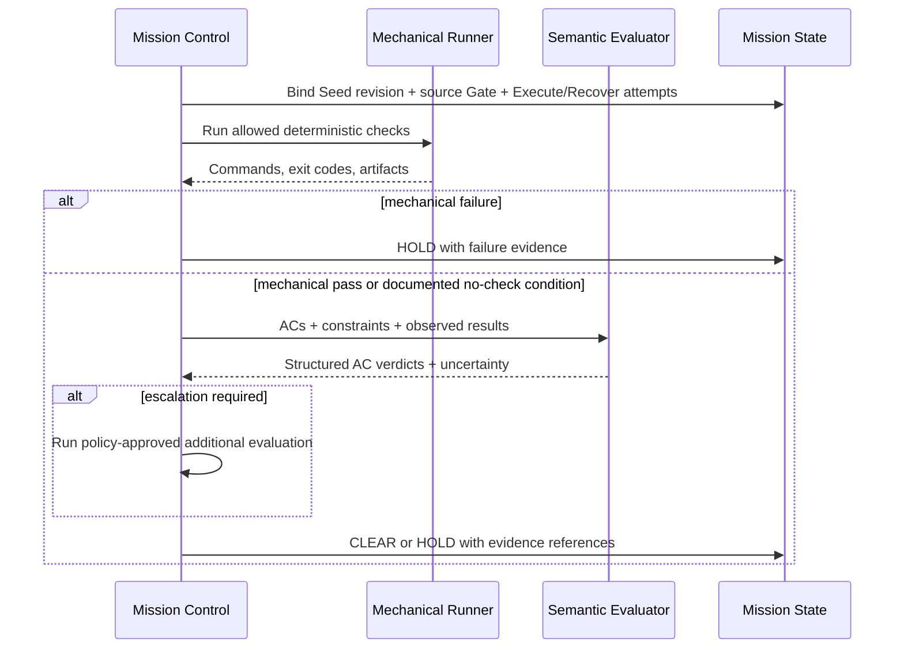

# Verify Stage Guide

> User-facing stage: **Verify**<br>
> Internal/upstream correspondence: **Evaluate / progressive evaluation**

| 항목 | 값 |
|---|---|
| 문서 지위 | Draft implementation guide |
| 선행 문서 | [Constitution](./00_MISSION_CONTROL.md), [Lifecycle](./02_MISSION_LIFECYCLE.md), [Execute](./07_EXECUTE.md), [Recover](./09_RECOVER.md) |
| 계획된 canonical CLI 명령 | `mcx verify` — 아직 구현된 명령이 아님 |
| 진입 전제 | 승인된 Blueprint와 Execute 또는 Recover 결과, 검증 가능한 Telemetry |
| 성공 결과 | `CLEAR — MISSION COMPLETE` |
| 실패 결과 | `HOLD`와 AC별 failure evidence |

---

## 1. 목적

Verify는 Flight Controller가 무엇을 했다고 **말했는지**가 아니라, 승인된
Blueprint가 실제 결과에서 충족되었는지를 판정하는 Stage다.

```text
Execution or recovery result
  → Mechanical checks
  → Semantic AC verification
  → Conditional escalation when justified
  → Gate decision with evidence
```

### Verify가 하지 않는 일

- 구현을 직접 수정하지 않는다.
- 실패를 숨기기 위해 검증 기준을 낮추지 않는다.
- 작업자의 자기 평가를 독립 증거로 취급하지 않는다.
- 테스트 통과만으로 모든 의미 요구사항이 충족됐다고 가정하지 않는다.
- LLM의 높은 확신만으로 `CLEAR`하지 않는다.
- 모든 작업에 비싼 다중 모델 합의를 강제하지 않는다.
- 승인된 Blueprint를 평가 중 재해석하지 않는다.

---

## 2. Upstream correspondence

Mission Control은 Ouroboros의 progressive evaluation 철학을 다음처럼 보존한다.

1. 저렴하고 결정적인 mechanical checks를 먼저 실행한다.
2. 통과한 결과를 Acceptance Criteria와 의미적으로 대조한다.
3. 모호하거나 위험한 경우에만 추가 평가를 사용할 수 있다.

현재 upstream은 mechanical, semantic, conditional consensus의 세 층을 제공하지만,
Mission Control v1은 먼저 mechanical + semantic의 독립성과 Gate 계약을 정확히
구현한다. Consensus는 필요성과 trigger policy가 문서화된 뒤 확장한다.

원본의 현재 동작과 수치에 대한 조사 결과는
[Upstream Mapping](./research/UPSTREAM_MAPPING.md)에 기록한다. upstream의
coverage, semantic score, drift threshold를 확인했다는 이유만으로 Mission
Control의 기본값으로 자동 채택하지 않는다.

---

## 3. Entry Contract

Verify 진입에는 다음이 필요하다.

- Mission과 현재 Stage를 식별할 수 있다.
- 현재 Stage가 Verify다.
- Execute 또는 Recover의 `CLEAR — Clear for Verify` GateDecision이 존재한다.
- source GateDecision과 그 결정이 참조한 source attempt를 식별할 수 있다.
- 정확한 승인 Blueprint/Seed revision이 존재한다.
- 대상 Acceptance Criteria와 Exit Conditions가 읽힌다.
- source Execute/Recover attempt와 변경 artifact를 추적할 수 있다.
- Runtime 결과와 명령 결과가 지속되어 있다.
- 검증 workspace가 실행 결과와 일치한다.
- 검증에 필요한 권한과 명령 정책이 명확하다.

필수 입력이 없으면 내용을 추측하지 않고 `HOLD`한다.

### Verification input identity

Verify report는 최소한 다음 identity tuple에 고정된다.

```text
mission_id
seed_revision
source_gate_decision_id
source_attempt_ids        # Execute 및 Recover attempt 포함
verification_attempt_id
workspace_snapshot_or_revision
```

검증 중 workspace가 바뀌면 기존 결과를 그대로 재사용하지 않는다.

---

## 4. Actors and separation of duties

### Mission Control

- 검증할 Seed revision, source GateDecision과 Execute/Recover attempts를 고정한다.
- mechanical command policy를 적용한다.
- semantic evaluator에 제한된 입력을 제공한다.
- 결과를 AC별로 정규화한다.
- Verify Gate를 판정한다.
- failure evidence를 Recover 입력으로 보존한다.

### Mechanical runner

- 허용된 결정적 명령을 실행한다.
- exit code, stdout/stderr, duration, artifact를 반환한다.
- 의미적 완료 판정을 내리지 않는다.

### Semantic evaluator

- Blueprint와 실제 결과를 각 AC별로 대조한다.
- Goal alignment, Constraint 준수, Non-goal 침범을 평가한다.
- 판정 근거와 uncertainty를 구조화해 반환한다.
- 코드를 수정하거나 Gate를 직접 선언하지 않는다.

### Flight Controller

Execute 또는 Recover를 수행한 동일한 Flight Controller의 설명은 보조 context로 사용할 수
있지만 독립 검증자가 아니다. 자기 보고만으로 AC를 통과시키지 않는다.

### User / Operator

- 자동으로 관찰할 수 없는 제품 판단을 결정한다.
- 위험이 큰 결과 또는 요구사항 재해석을 승인하거나 거절한다.
- Blueprint 변경이 필요한 경우 새 revision을 승인한다.

---

## 5. Verification layers

### 5.1 Layer 1 — Mechanical verification

Mechanical verification은 가능한 한 결정적이고 재현 가능해야 한다.

후보 검사:

- format/lint
- typecheck
- compile/build
- unit tests
- integration tests
- project-specific validation scripts
- 보안 또는 schema 검사
- Exit Condition에 명시된 명령

#### 규칙

- 프로젝트가 정의한 검증 명령을 우선한다.
- 임의의 위험한 Shell 문자열을 실행하지 않는다.
- command allowlist 또는 승인 정책을 적용한다.
- 각 명령의 실제 exit code를 보존한다.
- 실패한 출력을 성공 요약으로 덮지 않는다.
- 실행 환경, working directory, relevant env를 추적한다.
- 검사할 명령이 없다는 사실과 모든 검사가 통과했다는 사실을 구분한다.

Mechanical failure가 발생하면 기본적으로 semantic approval을 통해 성공으로
뒤집지 않는다. 단, 그 검사가 현재 미션에 적용되지 않는다는 명시적 정책 근거가
있다면 Gate report에 예외를 기록해야 한다.

### 5.2 Layer 2 — Semantic verification

테스트가 통과해도 제품 요구사항을 만족하지 않을 수 있다. Semantic verification은
실제 결과를 Blueprint와 대조한다.

각 Acceptance Criterion에 대해 다음을 판단한다.

```text
criterion
status: satisfied | not_satisfied | uncertain | not_observed
evidence references
observed behavior
reason
uncertainty
required follow-up
```

#### 필수 관점

- Goal에 실제로 기여하는가?
- Acceptance Criterion이 관찰 가능한 결과로 충족되었는가?
- Constraints를 위반하지 않았는가?
- Non-goals를 승인 없이 구현하지 않았는가?
- 구현이 다른 동작을 회귀시키지 않았는가?
- 주장과 evidence가 일치하는가?
- 검증하지 못한 부분을 통과로 가장하지 않았는가?

#### 실제 동작 관찰

UI, API, CLI, 파일 산출물처럼 diff만으로 충분하지 않은 경우 실제 동작을
관찰한다.

```text
Code diff says it exists
≠
Observed behavior proves it works
```

관찰 방법은 Stage 또는 Blueprint에 정의되어야 하며, 스크린샷, 명령 결과,
응답 payload, 생성 파일 등의 evidence를 연결한다.

### 5.3 Layer 3 — Conditional escalation

추가 평가자 또는 다중 모델 합의는 기본 경로가 아니다. 다음과 같이 결정이
실질적으로 불확실하거나 위험할 때 MAY 사용한다.

- Goal을 다시 해석해야 한다.
- evaluator uncertainty가 정책 기준보다 높다.
- 고위험 변경인데 mechanical evidence만으로 충분하지 않다.
- Seed revision 또는 ontology와 같은 실행 기준 변경이 제안된다.
- 서로 독립적인 evidence가 충돌한다.
- scope drift 여부를 단일 evaluator가 확신할 수 없다.

Consensus가 도입되더라도 다수결만으로 evidence 부족을 채우지 않는다. trigger,
참여자 독립성, 입력, 투표 규칙, 비용 한도, tie 처리 정책은 별도 ADR이 필요하다.

---

## 6. Evidence hierarchy

Verify는 evidence의 성격을 구분한다.

| 근거 | 예시 | 신뢰 방식 |
|---|---|---|
| Direct mechanical | exit code, test report, compiler output | 원본 결과와 환경을 보존 |
| Direct observation | 실제 UI/API/CLI 동작 | 재현 절차와 artifact 보존 |
| Repository fact | diff, file content, dependency graph | 검증 snapshot에 고정 |
| Runtime event | tool call/result, changed files | 원본 event와 adapter 정규화 연결 |
| Semantic judgment | AC 충족 분석 | 구조화된 이유와 uncertainty 필요 |
| Worker claim | “완료했다”는 설명 | 보조 context일 뿐 독립 증거 아님 |

직접 증거가 존재하는데 모델의 요약이 다르면 직접 증거를 우선한다.

---

## 7. Provisional verification report

아래는 의미를 설명하기 위한 초안이다.

```python
class CriterionVerdict:
    criterion_id: str
    status: str
    evidence_refs: tuple[str, ...]
    reason: str
    uncertainty: float | None


class VerificationReport:
    mission_id: str
    seed_revision: str
    source_gate_decision_id: str
    source_attempt_ids: tuple[str, ...]  # Execute and Recover attempts
    verification_attempt_id: str
    mechanical_results: tuple[object, ...]
    criterion_verdicts: tuple[CriterionVerdict, ...]
    constraint_violations: tuple[object, ...]
    non_goal_intrusions: tuple[object, ...]
    unresolved_risks: tuple[object, ...]
    evidence_refs: tuple[str, ...]
```

정확한 schema와 score 방향은 Architecture 및 Verify ADR에서 확정한다.

---

## 8. Normal sequence



### Detailed steps

1. 검증 identity tuple을 고정한다.
2. Blueprint의 AC와 Exit Conditions를 읽는다.
3. source Execute/Recover 결과와 workspace가 일치하는지 확인한다.
4. 허용된 mechanical checks를 결정한다.
5. 명령을 실행하고 원본 결과를 보존한다.
6. mechanical failure를 분류한다.
7. 진행 가능하면 AC별 semantic verification을 수행한다.
8. 실제 동작이 필요한 AC를 관찰한다.
9. Constraints, Non-goals, drift를 대조한다.
10. uncertainty와 evidence conflict를 확인한다.
11. 필요할 때만 escalation policy를 적용한다.
12. VerificationReport를 지속한다.
13. Gate가 `CLEAR — MISSION COMPLETE` 또는 `HOLD`를 선언한다.

---

## 9. Verify Gate

### `CLEAR — MISSION COMPLETE`

다음 조건을 모두 만족해야 한다.

- 필수 mechanical checks가 통과했다.
- 적용 가능한 검사를 생략했다면 정책 근거가 있다.
- 모든 필수 Acceptance Criteria가 evidence와 함께 충족되었다.
- Exit Conditions가 충족되었다.
- 미해결 Constraint violation이 없다.
- 승인되지 않은 Non-goal 구현이 없다.
- 검증하지 못한 필수 동작이 없다.
- evidence 출처와 workspace revision을 추적할 수 있다.
- unresolved risk가 완료를 막지 않는다는 명시적 근거가 있다.

### `HOLD`

다음 중 하나면 기본적으로 `HOLD`한다.

- mechanical check 실패
- 필수 AC 미충족
- AC 판정에 필요한 evidence 부족
- 실제 동작을 관찰하지 못함
- Constraint 위반
- Non-goal 또는 scope drift
- Blueprint 자체의 모순 또는 누락 발견
- workspace가 실행 결과 이후 변경됨
- evaluator 결과 파싱 실패 또는 높은 uncertainty
- Runtime/Telemetry 결과 사이의 충돌

HOLD report는 실패한 criterion, evidence, 권장 routing을 포함한다.

---

## 10. Recovery handoff

Verify는 코드를 수정하지 않고 실패를 Recover가 사용할 수 있는 packet으로 만든다.

```text
failed criterion
observed behavior
expected behavior
mechanical failures
evidence references
suspected scope
reproduction steps
constraints that must remain true
required re-verification
```

### 권장 routing

| 실패 원인 | 기본 목적지 |
|---|---|
| 구현 결함 | Recover가 bounded correction을 수행한 뒤 Verify |
| 테스트/검증 설정 결함 | Recover 또는 명시적 verification policy 수정 후 Verify |
| 제품 결정 누락 | Verify `HOLD` 후 Brief로 직접 routing |
| Seed/AC 모순 | Verify `HOLD` 후 Blueprint로 직접 routing 및 새 revision |
| 권한/환경 부족 | Verify HOLD, 사용자 또는 운영 조치 필요 |
| Verify가 생산할 observation/check evidence만 누락 | Verify에서 evidence-only attempt |
| Execute/Recover 결과 또는 Telemetry 누락 | 해당 evidence owner Stage로 routing; 새 `Clear for Verify` 전 Verify 진입 금지 |

정확한 전이는 [Mission Lifecycle](./02_MISSION_LIFECYCLE.md)이 소유한다.

---

## 11. CLI experience

```text
$ mcx verify

Mission: <mission id>
Blueprint: <approved revision>
Stage: VERIFY

Mechanical verification
  <check>: PASS
  <check>: PASS

Acceptance Criteria
  <criterion>: SATISFIED
  <criterion>: SATISFIED

CLEAR — MISSION COMPLETE
```

HOLD 예시:

```text
HOLD — Acceptance Criterion not satisfied

Criterion:
  <criterion id and description>

Observed:
  <actual behavior>

Expected:
  <required behavior>

Evidence:
  <reference>

Next:
  mcx recover
```

계획된 canonical command의 옵션과 출력 layout은 아직 정의하지 않는다.

---

## 12. Test matrix

| 영역 | 시나리오 | 기대 결과 |
|---|---|---|
| Entry | 승인 Seed 없음 | 검증 없이 HOLD |
| Entry | Execute CLEAR와 source attempts가 유효함 | Verify 진입 허용 |
| Entry | Recover CLEAR와 recovery attempt가 유효함 | Verify 진입 허용 |
| Entry | Clear for Verify 또는 source attempt가 없음 | owner Stage에서 보완, Verify 진입 금지 |
| Identity | workspace revision 불일치 | stale result로 분류, CLEAR 금지 |
| Mechanical | lint 실패 | semantic approval로 우회하지 않고 HOLD |
| Mechanical | 실행할 검사 없음 | “통과”와 구분된 상태 기록 |
| Mechanical | 명령 allowlist 위반 | 실행 차단과 policy evidence |
| Semantic | 모든 AC 충족 | evidence가 충분할 때 CLEAR 후보 |
| Semantic | 테스트는 통과하지만 AC 미충족 | HOLD |
| Semantic | Non-goal 구현 감지 | scope drift HOLD |
| Observation | UI AC인데 실제 관찰 없음 | not_observed, CLEAR 금지 |
| Evidence | worker claim만 존재 | 불충분 evidence로 HOLD |
| Uncertainty | evaluator가 uncertain | escalation 또는 HOLD |
| Parser | evaluator 구조화 출력 손상 | 성공으로 해석하지 않음 |
| Independence | executor 자기 평가만 사용 | 독립 검증 요구 |
| Recovery | 하나의 AC 실패 | 실패 packet이 Recover에 전달됨 |
| Completion | 모든 조건 충족 | Verify Gate만 MISSION COMPLETE 선언 |

### Regression scenarios

- 이미 통과한 AC가 새 교정으로 깨지는 경우
- 선택 테스트만 통과하고 전체 Exit Condition이 실패하는 경우
- 새 dependency가 Non-goal을 위반하는 경우
- diff에는 변경이 있으나 실행 workspace에는 반영되지 않은 경우
- command가 성공 exit를 반환했지만 기대 artifact가 없는 경우

---

## 13. Implementation slices

### Slice 1 — Verification domain

- AC verdict와 VerificationReport 의미를 정의한다.
- fake evidence로 Gate policy를 테스트한다.
- no-self-approval invariant를 테스트한다.

### Slice 2 — Mechanical runner

- 고정된 안전 명령 fixture를 실행한다.
- exit code, output, duration, artifact를 보존한다.
- failure short-circuit를 테스트한다.

### Slice 3 — Deterministic semantic fixture

- LLM 없이 AC/evidence mapping을 먼저 테스트한다.
- satisfied/not_satisfied/uncertain/not_observed를 구분한다.

### Slice 4 — Bounded semantic evaluator

- 구조화된 입력과 출력을 사용한다.
- 파일 수정과 Shell capability를 주지 않는다.
- parse failure와 uncertainty를 처리한다.

### Slice 5 — Observation adapters

- CLI/API/file output처럼 우선순위가 높은 한 유형부터 구현한다.
- evidence reference를 report에 연결한다.

### Slice 6 — `mcx verify`

- Core application boundary를 호출한다.
- Gate decision과 실패 packet을 표시한다.
- CLI 자체에 평가 로직을 복제하지 않는다.

---

## 14. Implementation checklist

- [ ] Verify identity tuple을 정의했다.
- [ ] source GateDecision과 Execute/Recover attempt를 함께 고정했다.
- [ ] 실행 결과와 검증 결과를 분리했다.
- [ ] mechanical command policy를 정의했다.
- [ ] command 원본 결과를 보존한다.
- [ ] AC별 verdict와 evidence reference를 정의했다.
- [ ] Constraint와 Non-goal 검사를 포함했다.
- [ ] 실제 동작 관찰이 필요한 AC를 표현할 수 있다.
- [ ] executor 자기 평가가 Gate를 통과시키지 못한다.
- [ ] parse failure와 missing evidence가 HOLD를 만든다.
- [ ] conditional escalation trigger를 별도 정책으로 격리했다.
- [ ] VerificationReport를 지속한다.
- [ ] Recover failure packet을 생성한다.
- [ ] Verify Gate만 MISSION COMPLETE를 선언한다.
- [ ] upstream과 다른 threshold를 명시적으로 기록한다.

---

## 15. Learning questions

1. 테스트가 모두 통과해도 요구사항을 만족하지 않을 수 있는 이유는 무엇인가?
2. 왜 mechanical verification이 semantic verification보다 먼저인가?
3. “검사가 없음”과 “검사가 통과함”을 구분해야 하는 이유는 무엇인가?
4. evaluator에게 파일 수정 권한을 주면 no-self-approval이 어떻게 깨지는가?
5. 실제 UI 동작을 diff만으로 검증할 수 없는 이유는 무엇인가?
6. consensus를 모든 작업에 사용하면 어떤 비용과 오류가 생기는가?
7. 어떤 evidence가 직접 증거이고 어떤 것은 주장에 불과한가?
8. workspace revision을 고정하지 않으면 report가 왜 재현 불가능해지는가?

---

## 16. Open decisions

- project verification command 발견 방식
- allowlist와 사용자 정의 command 정책
- command output 크기와 redaction
- semantic verdict schema와 score 사용 여부
- uncertainty 표현과 escalation threshold
- 실제 동작 observation adapter 우선순위
- regression scope와 테스트 선택 전략
- conditional consensus의 v1 포함 여부
- evaluator 독립성 보장 방식
- verification report 서명 또는 hash 필요성
- stale workspace 감지 방식
- incomplete/blocked/cancelled mission의 최종 표현

이 항목은 원본 수치를 그대로 복사하지 않고 Mission Control의 최소 실패 사례와
테스트를 먼저 정의한 뒤 결정한다.

---

## Exit statement

Verify의 성공은 모델의 확신이 아니라 추적 가능한 근거의 결론이다.

> **Every required criterion is satisfied by observable evidence, every exit
> condition holds, and no unresolved violation blocks completion.**
